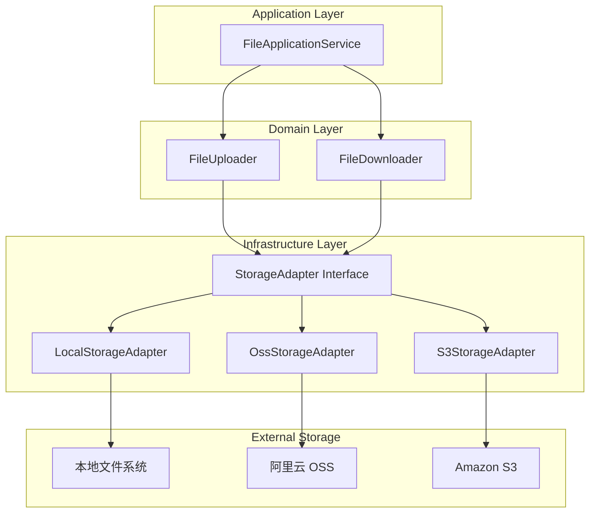

# file-app 设计文档

> Jira Issue: WCS-1636  
> 版本: 2.0  
> 日期: 2025-12-22  
> 关联需求: [requirements.md](./requirements.md)

---

## 1. 概述

### 1.1 项目背景

将 file-backend 的完整功能迁移到 wms-lite-backend-2/file-app 模块，保持 API 兼容性，支持多租户，使用 file_detail 表结构。

### 1.2 核心功能

- 基础文件上传/下载/删除/查询
- 多存储平台支持（OSS/S3/LOCAL）
- Bucket 管理（存储桶配置）
- 访问配置（AccessConfig）
- 缩略图生成
- 水印添加
- PDF 转图片
- 文件预览 URL（带过期时间）
- 多租户支持（X-Tenant-Id）

### 1.3 设计决策

| 决策 | 选择 | 理由 |
|------|------|------|
| 时间类型 | LocalDateTime | 符合 wms-lite-backend-2 规范，使用 TimeZones.now() |
| 租户隔离 | @TenantIsolation | 复用 common 模块已有注解 |
| 字段命名 | 驼峰命名 | 符合 wms-lite-backend-2 数据库规范 |
| ID 类型 | Long 自增 | 与 file-backend 保持一致 |
| 存储适配器 | 策略模式 | 支持多存储平台扩展 |
| 基类继承 | BaseCompanyEntity | 使用 common 模块的 `com.t5.infrastructure.persistence.common.BaseCompanyEntity` |
| fileType 字段 | MIME 枚举 | 保留 file-backend 的 MIME 枚举类型，便于类型校验 |
| 默认 Bucket | 按创建时间取第一个 | 简单实现，无需额外字段 |
| 文件删除 | 软删除 | 设置 voidBy/voidTime，物理文件保留 |
| 缩略图生成 | createThumbnail 参数控制 | 默认 true，可设为 false 跳过生成 |
| PDF 拆分异步 | Spring @Async | 简单异步，不使用 XXL-Job 或 Kafka |
| 现有 file-app | 完全替换 | 替换现有简化实现 |
| 错误码范围 | 5001-5099 | 与 IamErrorCode (3001-3515) 不冲突 |

---

## 2. 架构设计

### 2.1 DDD 分层架构

```
file-app/
├── src/main/java/com/t5/file/
│   ├── FileApplication.java
│   │
│   ├── interfaces/                              # 表现层
│   │   └── rest/
│   │       ├── FileController.java              # 文件操作接口
│   │       └── PdfController.java               # PDF 拆分接口
│   │
│   ├── application/                             # 应用层
│   │   ├── file/
│   │   │   ├── dto/                             # 数据传输对象
│   │   │   │   ├── FilePreviewDto.java
│   │   │   │   ├── FileUploadCmd.java
│   │   │   │   ├── FileQueryCmd.java
│   │   │   │   ├── SplitFileJobDto.java
│   │   │   │   └── WatermarkConfig.java
│   │   │   ├── assembler/
│   │   │   │   ├── FileAssembler.java
│   │   │   │   └── SplitFileJobAssembler.java
│   │   │   └── service/
│   │   │       ├── FileApplicationService.java
│   │   │       └── PdfApplicationService.java
│   │   └── storage/
│   │       └── service/
│   │           └── RouteService.java            # 路由解析服务
│   │
│   ├── domain/                                  # 领域层
│   │   ├── file/
│   │   │   ├── entity/
│   │   │   │   ├── FileDetail.java
│   │   │   │   ├── ThumbnailImage.java
│   │   │   │   ├── SplitFileJob.java
│   │   │   │   └── SplitFileDetail.java
│   │   │   ├── repository/
│   │   │   │   ├── FileDetailRepository.java
│   │   │   │   ├── ThumbnailImageRepository.java
│   │   │   │   ├── SplitFileJobRepository.java
│   │   │   │   └── SplitFileDetailRepository.java
│   │   │   └── service/
│   │   │       ├── FileUploader.java
│   │   │       ├── FileDownloader.java
│   │   │       ├── ThumbnailMaker.java
│   │   │       ├── WatermarkMaker.java
│   │   │       └── Pdf2ImageConvertor.java
│   │   ├── bucket/
│   │   │   ├── entity/
│   │   │   │   └── Bucket.java
│   │   │   └── repository/
│   │   │       └── BucketRepository.java
│   │   ├── config/
│   │   │   ├── entity/
│   │   │   │   ├── AccessConfig.java
│   │   │   │   ├── ConfigMetadata.java
│   │   │   │   └── Route.java
│   │   │   └── repository/
│   │   │       ├── AccessConfigRepository.java
│   │   │       ├── ConfigMetadataRepository.java
│   │   │       └── RouteRepository.java
│   │   └── common/
│   │       └── enums/
│   │           ├── OSSPlatform.java
│   │           ├── BucketStatus.java
│   │           ├── FileStatus.java
│   │           ├── RouteType.java
│   │           └── SplitFileJobStatus.java
│   │
│   └── infrastructure/                          # 基础设施层
│       ├── persistence/
│       │   ├── file/
│       │   │   ├── FileDetailMapper.java
│       │   │   ├── FileDetailRepositoryImpl.java
│       │   │   └── ...
│       │   ├── bucket/
│       │   │   └── ...
│       │   └── config/
│       │       └── ...
│       ├── storage/
│       │   ├── StorageAdapter.java              # 存储适配器接口
│       │   ├── LocalStorageAdapter.java
│       │   ├── OssStorageAdapter.java
│       │   └── S3StorageAdapter.java
│       ├── config/
│       │   └── FileStorageProperties.java
│       ├── enums/
│       │   └── FileErrorCode.java
│       └── exception/
│           └── FileException.java
│
└── src/main/resources/
    ├── application.yml
    └── mapper/
        └── *.xml
```


### 2.2 层次职责

| 层次 | 职责 | 依赖方向 |
|------|------|----------|
| interfaces | HTTP 请求处理、参数校验、响应封装 | → application |
| application | 业务流程编排、DTO 转换、事务管理 | → domain |
| domain | 核心业务逻辑、实体、仓储接口 | 无外部依赖 |
| infrastructure | 技术实现（数据库、存储平台） | → domain |

### 2.3 存储适配器架构



---

## 3. 组件与接口

### 3.1 API 接口总览

#### 3.1.1 文件操作接口 `/file`

| 方法 | 路径 | 功能 | 对应需求 |
|------|------|------|----------|
| POST | `/file/upload` | 单文件上传 | 需求 1 |
| GET | `/file/{id}` | 文件下载 | 需求 2 |
| GET | `/file/{id}/preview` | 获取预览 URL | 需求 2 |
| POST | `/file/preview` | 批量获取预览 URL | 需求 2 |
| GET | `/file/{id}/thumbnail` | 获取缩略图 | 需求 5 |
| POST | `/file/pdf-convert` | 上传 PDF 并转换为图片 | 需求 7 |
| GET | `/file/{id}/{fileKey}/view` | 直接查看文件 | 需求 2 |

#### 3.1.2 PDF 拆分接口 `/pdf`

| 方法 | 路径 | 功能 | 对应需求 |
|------|------|------|----------|
| POST | `/pdf/split` | 上传 PDF 并创建拆分任务 | 需求 7 |
| POST | `/pdf/split-by-file-id` | 按文件 ID 创建拆分任务 | 需求 7 |
| POST | `/pdf/split-by-url` | 按 URL 创建拆分任务 | 需求 7 |
| POST | `/pdf/split-direct` | 直接拆分并返回结果 | 需求 7 |
| GET | `/pdf/job/{id}` | 查询拆分任务 | 需求 7 |
| GET | `/pdf/job/file/{fileId}` | 按文件 ID 查询任务 | 需求 7 |
| GET | `/pdf/job/return/{returnId}` | 按 returnId 查询任务 | 需求 7 |
| GET | `/pdf/job/{id}/retry-processing` | 重试处理中的任务 | 需求 7 |


### 3.2 核心接口定义

#### 3.2.1 StorageAdapter 接口

```java
/**
 * 存储适配器接口
 * 支持多存储平台（LOCAL/OSS/S3）
 */
public interface StorageAdapter {
    
    /**
     * 获取支持的平台类型
     */
    OSSPlatform getPlatform();
    
    /**
     * 上传文件
     * @param fileKey 文件唯一标识（雪花ID）
     * @param inputStream 文件输入流
     * @param contentType 文件类型
     * @param metadata 配置元数据
     * @return 存储路径
     */
    String upload(String fileKey, InputStream inputStream, String contentType, 
                  Map<String, String> metadata);
    
    /**
     * 下载文件
     * @param fileKey 文件唯一标识
     * @param metadata 配置元数据
     * @return 文件输入流
     */
    InputStream download(String fileKey, Map<String, String> metadata);
    
    /**
     * 删除文件
     * @param fileKey 文件唯一标识
     * @param metadata 配置元数据
     */
    void delete(String fileKey, Map<String, String> metadata);
    
    /**
     * 生成预签名 URL
     * @param fileKey 文件唯一标识
     * @param expireHours 过期时间（小时）
     * @param metadata 配置元数据
     * @return 预签名 URL
     */
    String generatePresignedUrl(String fileKey, long expireHours, 
                                 Map<String, String> metadata);
    
    /**
     * 检查文件是否存在
     * @param fileKey 文件唯一标识
     * @param metadata 配置元数据
     * @return 是否存在
     */
    boolean exists(String fileKey, Map<String, String> metadata);
}
```

#### 3.2.2 RouteService 接口

```java
/**
 * 路由服务
 * 根据 Bucket 和操作类型获取对应的存储配置
 */
public interface RouteService {
    
    /**
     * 获取写入配置
     * @param bucket 存储桶
     * @return 访问配置（含元数据）
     */
    AccessConfigWithMetadata getWriteConfig(Bucket bucket);
    
    /**
     * 获取读取配置
     * @param bucket 存储桶
     * @return 访问配置（含元数据）
     */
    AccessConfigWithMetadata getReadConfig(Bucket bucket);
}
```

#### 3.2.3 FileUploader 领域服务

```java
/**
 * 文件上传领域服务
 */
public interface FileUploader {
    
    /**
     * 上传文件
     * @param file 临时文件
     * @param fileDetail 文件详情实体
     * @param accessConfig 访问配置
     * @return 文件预览 DTO
     */
    FilePreviewDto upload(File file, FileDetail fileDetail, 
                          AccessConfigWithMetadata accessConfig);
}
```


---

## 4. 数据模型

### 4.1 实体类继承关系

```
BaseEntity (无租户隔离)
├── AccessConfig
├── ConfigMetadata
└── Route

BaseCompanyEntity (有租户隔离，包含 tenantId + isolationId)
├── FileDetail
├── Bucket
├── ThumbnailImage
├── SplitFileJob
└── SplitFileDetail
```

**设计决策**：
- 有租户隔离的实体继承 `BaseCompanyEntity`，自动包含 `tenantId` 和 `isolationId` 字段
- 无租户隔离的实体（全局配置）继承 `BaseEntity`
- `BaseCompanyEntity` 已包含 `@TenantIsolation` 注解，子类无需重复添加

### 4.2 实体类设计

#### 4.2.1 FileDetail 文件详情（继承 BaseCompanyEntity）

```java
@Data
@EqualsAndHashCode(callSuper = true)
@TableName(value = "file_detail", autoResultMap = true)
public class FileDetail extends BaseCompanyEntity {
    @TableId(type = IdType.AUTO)
    private Long id;
    
    private String filename;           // 原始文件名
    private Long bucketId;             // 存储桶ID
    private String fileKey;            // 雪花ID，存储路径标识
    private String fileType;           // MIME 类型
    private Long fileByteSize;         // 文件大小（字节）
    private Integer version;           // 版本号
    private String externalFilename;   // 外部文件名
    private Long accessConfigId;       // 访问配置ID
    private FileStatus status;         // 文件状态（枚举）
    private Boolean dir;               // 是否目录
    private String objectId;           // 业务对象ID
    private String objectType;         // 业务对象类型
    
    // 继承自 BaseCompanyEntity: tenantId, isolationId
    // 继承自 BaseEntity: createdBy, createdTime, updatedBy, updatedTime
    
    // 软删除字段
    private String voidBy;
    private LocalDateTime voidTime;
    
    // 业务方法
    public void increaseVersion() {
        this.version = (this.version == null ? 1 : this.version) + 1;
    }
}
```

#### 4.2.2 Bucket 存储桶（继承 BaseCompanyEntity）

```java
@Data
@EqualsAndHashCode(callSuper = true)
@TableName(value = "bucket", autoResultMap = true)
public class Bucket extends BaseCompanyEntity {
    @TableId(type = IdType.AUTO)
    private Long id;
    
    private String name;               // 桶名称
    private Long usedByteSize;         // 已使用容量
    private BucketStatus status;       // 状态（枚举）
    
    // 继承自 BaseCompanyEntity: tenantId, isolationId
    // 继承自 BaseEntity: createdBy, createdTime, updatedBy, updatedTime
    
    // 软删除字段
    private String voidBy;
    private LocalDateTime voidTime;
    
    // 业务方法
    public boolean isActive() {
        return BucketStatus.USING.equals(this.status);
    }
    
    public void addUsedSize(long size) {
        this.usedByteSize = (this.usedByteSize == null ? 0 : this.usedByteSize) + size;
    }
}
```

#### 4.2.3 AccessConfig 访问配置（继承 BaseEntity，无租户隔离）

```java
@Data
@EqualsAndHashCode(callSuper = true)
@TableName(value = "access_config", autoResultMap = true)
public class AccessConfig extends BaseEntity {
    @TableId(type = IdType.AUTO)
    private Long id;
    
    private String tenantId;           // 租户ID（全局配置可为空）
    private OSSPlatform platform;      // 平台类型（枚举）
    private ConfigStatus status;       // 状态（枚举）
    
    // 继承自 BaseEntity: createdBy, createdTime, updatedBy, updatedTime
    
    // 软删除字段
    private String voidBy;
    private LocalDateTime voidTime;
}
```

#### 4.2.4 ConfigMetadata 配置元数据（继承 BaseEntity，无租户隔离）

```java
@Data
@EqualsAndHashCode(callSuper = true)
@TableName(value = "config_metadata", autoResultMap = true)
public class ConfigMetadata extends BaseEntity {
    @TableId(type = IdType.AUTO)
    private Long id;
    
    private Long accessConfigId;       // 访问配置ID
    private String configKey;          // 配置键
    private String configValue;        // 配置值
    private ConfigStatus status;       // 状态（枚举）
    
    // 继承自 BaseEntity: createdBy, createdTime, updatedBy, updatedTime
    
    // 软删除字段
    private String voidBy;
    private LocalDateTime voidTime;
}
```


#### 4.2.5 Route 路由配置（继承 BaseEntity，无租户隔离）

```java
@Data
@EqualsAndHashCode(callSuper = true)
@TableName(value = "route", autoResultMap = true)
public class Route extends BaseEntity {
    @TableId(type = IdType.AUTO)
    private Long id;
    
    private Long bucketId;             // 存储桶ID
    private RouteType routeType;       // 路由类型（枚举）
    private Long accessConfigId;       // 访问配置ID
    private RouteStatus status;        // 状态（枚举）
    
    // 继承自 BaseEntity: createdBy, createdTime, updatedBy, updatedTime
    
    // 软删除字段
    private String voidBy;
    private LocalDateTime voidTime;
}
```

#### 4.2.6 ThumbnailImage 缩略图（继承 BaseCompanyEntity）

```java
@Data
@EqualsAndHashCode(callSuper = true)
@TableName(value = "thumbnail_image", autoResultMap = true)
public class ThumbnailImage extends BaseCompanyEntity {
    @TableId(type = IdType.AUTO)
    private Long id;
    
    private Long fileDetailId;         // 关联文件ID
    private String thumbnailName;      // 缩略图名称
    private String fileKey;            // 存储路径标识
    private Long thumbnailByteSize;    // 缩略图大小
    private FileStatus status;         // 状态（枚举）
    
    // 继承自 BaseCompanyEntity: tenantId, isolationId
    // 继承自 BaseEntity: createdBy, createdTime, updatedBy, updatedTime
    
    // 软删除字段
    private String voidBy;
    private LocalDateTime voidTime;
}
```

#### 4.2.7 SplitFileJob PDF 拆分任务（继承 BaseCompanyEntity）

```java
@Data
@EqualsAndHashCode(callSuper = true)
@TableName(value = "split_file_job", autoResultMap = true)
public class SplitFileJob extends BaseCompanyEntity {
    @TableId(type = IdType.AUTO)
    private Long id;
    
    private Long fileId;               // 原始 PDF 文件ID
    private LocalDateTime createDateTime;
    private LocalDateTime startDateTime;
    private LocalDateTime endDateTime;
    private String returnId;           // 业务回调ID
    private String returnType;         // 业务类型
    private SplitFileJobStatus status; // 状态（枚举）
    private String statusTxt;          // 状态描述
    private Integer retryCount;        // 重试次数
    private Integer fileSplitStatus;   // 拆分状态
    private String fileSplitDetail;    // 拆分详情
    private Integer kafkaSendStatus;   // Kafka 发送状态
    private String kafkaSendDetail;    // Kafka 发送详情
    private String errorCode;          // 错误码
    private String errorDetail;        // 错误详情
    
    // 继承自 BaseCompanyEntity: tenantId, isolationId
    // 继承自 BaseEntity: createdBy, createdTime, updatedBy, updatedTime
    
    // 软删除字段
    private String voidBy;
    private LocalDateTime voidTime;
    
    // 业务方法
    public boolean canStartProcess() {
        return SplitFileJobStatus.NEW.equals(this.status);
    }
    
    public boolean canRetry(int maxRetryCount) {
        return SplitFileJobStatus.PROCESSED_WITH_ERROR.equals(this.status) 
               && this.retryCount != null && this.retryCount < maxRetryCount;
    }
    
    public void startProcess(String operator) {
        this.status = SplitFileJobStatus.PROCESSING;
        this.startDateTime = TimeZones.now();
        this.setUpdatedBy(operator);
        this.setUpdatedTime(TimeZones.now());
    }
    
    public void completeProcess(String operator) {
        this.status = SplitFileJobStatus.PROCESSED;
        this.endDateTime = TimeZones.now();
        this.setUpdatedBy(operator);
        this.setUpdatedTime(TimeZones.now());
    }
    
    public void failProcess(String errorCode, String errorDetail, String operator) {
        this.status = SplitFileJobStatus.PROCESSED_WITH_ERROR;
        this.errorCode = errorCode;
        this.errorDetail = errorDetail;
        this.endDateTime = TimeZones.now();
        this.setUpdatedBy(operator);
        this.setUpdatedTime(TimeZones.now());
    }
}
```


#### 4.2.8 SplitFileDetail PDF 拆分明细（继承 BaseCompanyEntity）

```java
@Data
@EqualsAndHashCode(callSuper = true)
@TableName(value = "split_file_detail", autoResultMap = true)
public class SplitFileDetail extends BaseCompanyEntity {
    @TableId(type = IdType.AUTO)
    private Long id;
    
    private Long jobId;                // 拆分任务ID
    private Long fileId;               // 拆分后的图片文件ID
    private Long originalFileId;       // 原始 PDF 文件ID
    private Integer pageNumber;        // 页码（从1开始）
    private Integer pageIndex;         // 页索引（从0开始）
    private String fileName;           // 图片文件名
    private Long fileSize;             // 图片文件大小
    private String fileType;           // 图片类型
    
    // 继承自 BaseCompanyEntity: tenantId, isolationId
    // 继承自 BaseEntity: createdBy, createdTime, updatedBy, updatedTime
    
    // 软删除字段
    private String voidBy;
    private LocalDateTime voidTime;
}
```

### 4.3 枚举定义（参照 file-backend）

#### 4.3.1 OSSPlatform 存储平台

```java
/**
 * 存储平台枚举
 * 参照 file-backend
 */
public enum OSSPlatform {
    AMAZON,    // Amazon S3
    ALI,       // 阿里云 OSS
    LOCAL      // 本地存储
}
```

#### 4.3.2 BucketStatus 存储桶状态

```java
/**
 * 存储桶状态枚举
 * 参照 file-backend
 */
@Getter
@RequiredArgsConstructor
public enum BucketStatus {
    USING(10),
    DELETED(90);
    
    @EnumValue
    private final Integer code;
}
```

#### 4.3.3 FileStatus 文件状态

```java
/**
 * 文件状态枚举
 * 参照 file-backend
 */
@Getter
@RequiredArgsConstructor
public enum FileStatus {
    USING(10),
    DELETE(90);
    
    @EnumValue
    private final Integer code;
}
```

#### 4.3.4 RouteType 路由类型

```java
/**
 * 路由类型枚举
 * 参照 file-backend
 */
@Getter
public enum RouteType {
    /**
     * 直接连接指定的外部存储
     */
    DIRECT(10),
    /**
     * 根据配置策略连接外部存储
     */
    MIXED(20);
    
    @EnumValue
    private final Integer code;
    
    RouteType(Integer code) {
        this.code = code;
    }
}
```

#### 4.3.5 RouteStatus 路由状态

```java
/**
 * 路由状态枚举
 * 参照 file-backend
 */
@Getter
@RequiredArgsConstructor
public enum RouteStatus {
    USING(10),
    DELETE(90);
    
    @EnumValue
    private final Integer code;
}
```

#### 4.3.6 ConfigStatus 配置状态

```java
/**
 * 配置状态枚举
 * 参照 file-backend
 */
@Getter
@RequiredArgsConstructor
public enum ConfigStatus {
    USING(10),
    DELETED(90);
    
    @EnumValue
    private final Integer code;
}
```

#### 4.3.7 SplitFileJobStatus 拆分任务状态

```java
/**
 * PDF 拆分任务状态枚举
 * 参照 file-backend
 */
@Getter
@AllArgsConstructor
public enum SplitFileJobStatus {
    NEW("NEW", "New"),
    PROCESSING("PROCESSING", "Processing"),
    PROCESSED("PROCESSED", "Processed"),
    PROCESSED_WITH_ERROR("PROCESSED_WITH_ERROR", "Processed with error");
    
    private final String code;
    private final String description;
    
    /**
     * 根据状态码获取枚举值
     */
    public static SplitFileJobStatus fromCode(String code) {
        if (code == null) {
            return null;
        }
        for (SplitFileJobStatus status : values()) {
            if (status.getCode().equals(code)) {
                return status;
            }
        }
        throw new IllegalArgumentException("Unknown SplitFileJobStatus code: " + code);
    }
    
    /**
     * 检查状态转换是否有效
     */
    public boolean canTransitionTo(SplitFileJobStatus targetStatus) {
        return switch (this) {
            case NEW -> targetStatus == PROCESSING;
            case PROCESSING -> targetStatus == PROCESSED || targetStatus == PROCESSED_WITH_ERROR;
            case PROCESSED_WITH_ERROR -> targetStatus == PROCESSING; // 允许重试
            default -> false;
        };
    }
}
```

### 4.3 DTO 定义

#### 4.3.1 FilePreviewDto

```java
public record FilePreviewDto(
    Long id,
    String filename,
    String fileType,
    Long fileByteSize,
    String previewUrl
) {}
```

#### 4.3.2 FileUploadCmd

```java
public record FileUploadCmd(
    String filename,
    String bucket,
    String objectId,
    String objectType,
    String operator,
    Boolean addWatermark,
    Boolean createThumbnail,
    Long fileUrlDurationHour
) {}
```

#### 4.3.3 WatermarkConfig

```java
public record WatermarkConfig(
    boolean enabled,
    String text,
    String position,      // CENTER/TOP_LEFT/TOP_RIGHT/BOTTOM_LEFT/BOTTOM_RIGHT/TILE
    Integer fontSize,
    String fontColor,
    Float opacity
) {}
```


### 4.5 数据库表结构

**注意**：有租户隔离的表需要包含 `tenantId` 和 `isolationId` 字段。

#### 4.5.1 file_detail 文件详情表（有租户隔离）

```sql
CREATE TABLE IF NOT EXISTS `file_detail` (
    `id` BIGINT NOT NULL AUTO_INCREMENT COMMENT '主键ID',
    `filename` VARCHAR(256) NOT NULL COMMENT '原始文件名',
    `bucketId` BIGINT NOT NULL COMMENT '存储桶ID',
    `fileKey` VARCHAR(64) NULL COMMENT '雪花ID，存储路径标识',
    `fileType` VARCHAR(128) NOT NULL COMMENT 'MIME类型',
    `fileByteSize` BIGINT NOT NULL COMMENT '文件大小(字节)',
    `version` INT NOT NULL DEFAULT 1 COMMENT '版本号',
    `externalFilename` VARCHAR(256) NULL COMMENT '外部文件名',
    `accessConfigId` BIGINT NOT NULL COMMENT '访问配置ID',
    `status` TINYINT NOT NULL DEFAULT 10 COMMENT '状态：10-使用中，90-删除',
    `dir` TINYINT NOT NULL DEFAULT 0 COMMENT '是否目录：0-否，1-是',
    `objectId` VARCHAR(128) NULL COMMENT '业务对象ID',
    `objectType` VARCHAR(128) NULL COMMENT '业务对象类型',
    `tenantId` VARCHAR(64) NOT NULL COMMENT '租户ID',
    `isolationId` VARCHAR(64) NULL COMMENT '隔离ID',
    `createdBy` VARCHAR(64) NOT NULL COMMENT '创建人',
    `createdTime` DATETIME NOT NULL COMMENT '创建时间',
    `updatedBy` VARCHAR(64) NOT NULL COMMENT '更新人',
    `updatedTime` DATETIME NOT NULL COMMENT '更新时间',
    `voidBy` VARCHAR(64) NULL COMMENT '删除人',
    `voidTime` DATETIME NULL COMMENT '删除时间',
    PRIMARY KEY (`id`),
    KEY `idx_file_detail_tenant_filename` (`tenantId`, `filename`, `version`),
    KEY `idx_file_detail_bucket` (`bucketId`),
    KEY `idx_file_detail_fileKey` (`fileKey`)
) ENGINE=InnoDB DEFAULT CHARSET=utf8mb4 COLLATE=utf8mb4_general_ci COMMENT='文件详情表';
```

#### 4.5.2 bucket 存储桶表（有租户隔离）

```sql
CREATE TABLE IF NOT EXISTS `bucket` (
    `id` BIGINT NOT NULL AUTO_INCREMENT COMMENT '主键ID',
    `name` VARCHAR(128) NOT NULL COMMENT '桶名称',
    `tenantId` VARCHAR(64) NOT NULL COMMENT '租户ID',
    `isolationId` VARCHAR(64) NULL COMMENT '隔离ID',
    `usedByteSize` BIGINT NOT NULL DEFAULT 0 COMMENT '已使用容量',
    `status` TINYINT NOT NULL DEFAULT 10 COMMENT '状态：10-使用中，90-删除',
    `createdBy` VARCHAR(64) NOT NULL COMMENT '创建人',
    `createdTime` DATETIME NOT NULL COMMENT '创建时间',
    `updatedBy` VARCHAR(64) NOT NULL COMMENT '更新人',
    `updatedTime` DATETIME NOT NULL COMMENT '更新时间',
    `voidBy` VARCHAR(64) NULL COMMENT '删除人',
    `voidTime` DATETIME NULL COMMENT '删除时间',
    PRIMARY KEY (`id`),
    UNIQUE KEY `uk_bucket_tenant_name` (`tenantId`, `name`)
) ENGINE=InnoDB DEFAULT CHARSET=utf8mb4 COLLATE=utf8mb4_general_ci COMMENT='存储桶表';
```

#### 4.5.3 access_config 访问配置表（无租户隔离）

```sql
CREATE TABLE IF NOT EXISTS `access_config` (
    `id` BIGINT NOT NULL AUTO_INCREMENT COMMENT '主键ID',
    `tenantId` VARCHAR(64) NULL COMMENT '租户ID（全局配置可为空）',
    `platform` VARCHAR(32) NOT NULL COMMENT '平台类型：AMAZON/ALI/LOCAL',
    `status` TINYINT NOT NULL DEFAULT 10 COMMENT '状态：10-使用中，90-删除',
    `createdBy` VARCHAR(64) NOT NULL COMMENT '创建人',
    `createdTime` DATETIME NOT NULL COMMENT '创建时间',
    `updatedBy` VARCHAR(64) NOT NULL COMMENT '更新人',
    `updatedTime` DATETIME NOT NULL COMMENT '更新时间',
    `voidBy` VARCHAR(64) NULL COMMENT '删除人',
    `voidTime` DATETIME NULL COMMENT '删除时间',
    PRIMARY KEY (`id`),
    KEY `idx_access_config_tenant_platform` (`tenantId`, `platform`)
) ENGINE=InnoDB DEFAULT CHARSET=utf8mb4 COLLATE=utf8mb4_general_ci COMMENT='访问配置表';
```


#### 4.5.4 config_metadata 配置元数据表（无租户隔离）

```sql
CREATE TABLE IF NOT EXISTS `config_metadata` (
    `id` BIGINT NOT NULL AUTO_INCREMENT COMMENT '主键ID',
    `accessConfigId` BIGINT NOT NULL COMMENT '访问配置ID',
    `configKey` VARCHAR(64) NOT NULL COMMENT '配置键',
    `configValue` VARCHAR(256) NOT NULL COMMENT '配置值',
    `status` TINYINT NOT NULL DEFAULT 10 COMMENT '状态：10-使用中，90-删除',
    `createdBy` VARCHAR(64) NOT NULL COMMENT '创建人',
    `createdTime` DATETIME NOT NULL COMMENT '创建时间',
    `updatedBy` VARCHAR(64) NOT NULL COMMENT '更新人',
    `updatedTime` DATETIME NOT NULL COMMENT '更新时间',
    `voidBy` VARCHAR(64) NULL COMMENT '删除人',
    `voidTime` DATETIME NULL COMMENT '删除时间',
    PRIMARY KEY (`id`),
    KEY `idx_config_metadata_access_config` (`accessConfigId`)
) ENGINE=InnoDB DEFAULT CHARSET=utf8mb4 COLLATE=utf8mb4_general_ci COMMENT='配置元数据表';
```

#### 4.5.5 route 路由配置表（无租户隔离）

```sql
CREATE TABLE IF NOT EXISTS `route` (
    `id` BIGINT NOT NULL AUTO_INCREMENT COMMENT '主键ID',
    `bucketId` BIGINT NOT NULL COMMENT '存储桶ID',
    `routeType` TINYINT NOT NULL COMMENT '路由类型：10-DIRECT，20-MIXED',
    `accessConfigId` BIGINT NOT NULL COMMENT '访问配置ID',
    `status` TINYINT NOT NULL DEFAULT 10 COMMENT '状态：10-使用中，90-删除',
    `createdBy` VARCHAR(64) NOT NULL COMMENT '创建人',
    `createdTime` DATETIME NOT NULL COMMENT '创建时间',
    `updatedBy` VARCHAR(64) NOT NULL COMMENT '更新人',
    `updatedTime` DATETIME NOT NULL COMMENT '更新时间',
    `voidBy` VARCHAR(64) NULL COMMENT '删除人',
    `voidTime` DATETIME NULL COMMENT '删除时间',
    PRIMARY KEY (`id`),
    KEY `idx_route_bucket` (`bucketId`)
) ENGINE=InnoDB DEFAULT CHARSET=utf8mb4 COLLATE=utf8mb4_general_ci COMMENT='路由配置表';
```

#### 4.5.6 thumbnail_image 缩略图表（有租户隔离）

```sql
CREATE TABLE IF NOT EXISTS `thumbnail_image` (
    `id` BIGINT NOT NULL AUTO_INCREMENT COMMENT '主键ID',
    `fileDetailId` BIGINT NOT NULL COMMENT '关联文件ID',
    `thumbnailName` VARCHAR(256) NOT NULL COMMENT '缩略图名称',
    `fileKey` VARCHAR(64) NULL COMMENT '存储路径标识',
    `thumbnailByteSize` BIGINT NOT NULL COMMENT '缩略图大小',
    `status` TINYINT NOT NULL DEFAULT 10 COMMENT '状态：10-使用中，90-删除',
    `tenantId` VARCHAR(64) NOT NULL COMMENT '租户ID',
    `isolationId` VARCHAR(64) NULL COMMENT '隔离ID',
    `createdBy` VARCHAR(64) NOT NULL COMMENT '创建人',
    `createdTime` DATETIME NOT NULL COMMENT '创建时间',
    `updatedBy` VARCHAR(64) NOT NULL COMMENT '更新人',
    `updatedTime` DATETIME NOT NULL COMMENT '更新时间',
    `voidBy` VARCHAR(64) NULL COMMENT '删除人',
    `voidTime` DATETIME NULL COMMENT '删除时间',
    PRIMARY KEY (`id`),
    KEY `idx_thumbnail_file_detail` (`fileDetailId`)
) ENGINE=InnoDB DEFAULT CHARSET=utf8mb4 COLLATE=utf8mb4_general_ci COMMENT='缩略图表';
```

#### 4.5.7 split_file_job PDF 拆分任务表（有租户隔离）

```sql
CREATE TABLE IF NOT EXISTS `split_file_job` (
    `id` BIGINT NOT NULL AUTO_INCREMENT COMMENT '主键ID',
    `fileId` BIGINT NOT NULL COMMENT '原始PDF文件ID',
    `createDateTime` DATETIME NOT NULL COMMENT '创建时间',
    `startDateTime` DATETIME NULL COMMENT '开始处理时间',
    `endDateTime` DATETIME NULL COMMENT '结束处理时间',
    `returnId` VARCHAR(64) NULL COMMENT '业务回调ID',
    `returnType` VARCHAR(64) NULL COMMENT '业务类型',
    `status` VARCHAR(32) NOT NULL COMMENT '状态：NEW/PROCESSING/PROCESSED/PROCESSED_WITH_ERROR',
    `statusTxt` VARCHAR(100) NULL COMMENT '状态描述',
    `retryCount` INT NOT NULL DEFAULT 0 COMMENT '重试次数',
    `fileSplitStatus` TINYINT NULL COMMENT '拆分状态',
    `fileSplitDetail` TEXT NULL COMMENT '拆分详情',
    `kafkaSendStatus` TINYINT NULL COMMENT 'Kafka发送状态',
    `kafkaSendDetail` TEXT NULL COMMENT 'Kafka发送详情',
    `errorCode` VARCHAR(32) NULL COMMENT '错误码',
    `errorDetail` TEXT NULL COMMENT '错误详情',
    `tenantId` VARCHAR(64) NOT NULL COMMENT '租户ID',
    `isolationId` VARCHAR(64) NULL COMMENT '隔离ID',
    `createdBy` VARCHAR(64) NOT NULL COMMENT '创建人',
    `createdTime` DATETIME NOT NULL COMMENT '创建时间',
    `updatedBy` VARCHAR(64) NOT NULL COMMENT '更新人',
    `updatedTime` DATETIME NOT NULL COMMENT '更新时间',
    `voidBy` VARCHAR(64) NULL COMMENT '删除人',
    `voidTime` DATETIME NULL COMMENT '删除时间',
    PRIMARY KEY (`id`),
    KEY `idx_split_job_tenant_status` (`tenantId`, `status`),
    KEY `idx_split_job_file` (`fileId`),
    KEY `idx_split_job_return` (`returnId`)
) ENGINE=InnoDB DEFAULT CHARSET=utf8mb4 COLLATE=utf8mb4_general_ci COMMENT='PDF拆分任务表';
```


#### 4.5.8 split_file_detail PDF 拆分明细表（有租户隔离）

```sql
CREATE TABLE IF NOT EXISTS `split_file_detail` (
    `id` BIGINT NOT NULL AUTO_INCREMENT COMMENT '主键ID',
    `jobId` BIGINT NOT NULL COMMENT '拆分任务ID',
    `fileId` BIGINT NOT NULL COMMENT '拆分后的图片文件ID',
    `originalFileId` BIGINT NOT NULL COMMENT '原始PDF文件ID',
    `pageNumber` INT NOT NULL COMMENT '页码（从1开始）',
    `pageIndex` INT NOT NULL COMMENT '页索引（从0开始）',
    `fileName` VARCHAR(256) NOT NULL COMMENT '图片文件名',
    `fileSize` BIGINT NOT NULL COMMENT '图片文件大小',
    `fileType` VARCHAR(32) NOT NULL COMMENT '图片类型',
    `tenantId` VARCHAR(64) NOT NULL COMMENT '租户ID',
    `isolationId` VARCHAR(64) NULL COMMENT '隔离ID',
    `createdBy` VARCHAR(64) NOT NULL COMMENT '创建人',
    `createdTime` DATETIME NOT NULL COMMENT '创建时间',
    `updatedBy` VARCHAR(64) NOT NULL COMMENT '更新人',
    `updatedTime` DATETIME NOT NULL COMMENT '更新时间',
    `voidBy` VARCHAR(64) NULL COMMENT '删除人',
    `voidTime` DATETIME NULL COMMENT '删除时间',
    PRIMARY KEY (`id`),
    KEY `idx_split_detail_job` (`jobId`),
    KEY `idx_split_detail_file` (`fileId`),
    KEY `idx_split_detail_original` (`originalFileId`)
) ENGINE=InnoDB DEFAULT CHARSET=utf8mb4 COLLATE=utf8mb4_general_ci COMMENT='PDF拆分明细表';
```

### 4.5 ConfigMetadata 配置键定义

| 平台 | 配置键 | 说明 |
|------|--------|------|
| LOCAL | basePath | 本地存储根目录 |
| ALI | endpoint | OSS 端点 |
| ALI | accessKeyId | 访问密钥ID |
| ALI | accessKeySecret | 访问密钥 |
| ALI | bucketName | OSS 桶名称 |
| AMAZON | region | S3 区域 |
| AMAZON | accessKeyId | 访问密钥ID |
| AMAZON | secretAccessKey | 访问密钥 |
| AMAZON | bucketName | S3 桶名称 |

---

## 5. 正确性属性

*A property is a characteristic or behavior that should hold true across all valid executions of a system-essentially, a formal statement about what the system should do. Properties serve as the bridge between human-readable specifications and machine-verifiable correctness guarantees.*

### Property 1: 文件上传返回完整元数据
*For any* 有效文件上传请求，上传成功后返回的 FilePreviewDto 应包含所有必需字段（id、filename、fileType、fileByteSize、previewUrl），且 id 不为空
**Validates: Requirements 1.1**

### Property 2: 租户隔离 - 文件关联正确租户
*For any* 携带 X-Tenant-Id 请求头的文件上传，保存的文件记录中的 tenantId 应与请求头中的值一致
**Validates: Requirements 1.2, 8.2, 8.3**

### Property 3: 默认 Bucket 选择
*For any* 未指定 bucket 的文件上传请求，文件应被存储到该租户的默认 bucket 中
**Validates: Requirements 1.3**

### Property 4: 业务关联字段存储
*For any* 携带 objectId 和 objectType 参数的文件上传，这些字段应被正确存储在文件记录中
**Validates: Requirements 1.4**

### Property 5: FileKey 唯一性
*For any* 文件上传，生成的 fileKey 应符合雪花ID格式且在系统中唯一
**Validates: Requirements 1.5**


### Property 6: 下载响应头正确性
*For any* 文件下载请求，响应应包含正确的 Content-Type（与文件类型一致）和 Content-Disposition 头
**Validates: Requirements 2.1**

### Property 7: 预览 URL 有效性
*For any* 预览 URL 请求，返回的 URL 应包含签名参数，且在指定过期时间内有效
**Validates: Requirements 2.2**

### Property 8: 批量预览返回完整列表
*For any* 批量预览请求，返回的 FilePreviewDto 列表数量应与请求的文件ID数量一致（排除不存在的文件）
**Validates: Requirements 2.3**

### Property 9: View 端点 FileKey 验证
*For any* view 端点请求，只有当 fileKey 参数与文件记录中的 fileKey 匹配时才返回文件内容
**Validates: Requirements 2.5**

### Property 10: Bucket 容量统计准确性
*For any* 文件上传到 bucket，bucket 的 usedByteSize 应增加该文件的大小
**Validates: Requirements 3.3**

### Property 11: 禁用 Bucket 阻止上传
*For any* 状态为 INACTIVE 的 bucket，向其上传文件应被拒绝
**Validates: Requirements 3.5**

### Property 12: 图片缩略图自动生成
*For any* 图片文件（JPEG/PNG/GIF/BMP）上传且 createThumbnail=true，应自动生成缩略图并存储元数据
**Validates: Requirements 5.1, 5.3**

### Property 13: 缩略图按需生成
*For any* 缩略图请求，如果缩略图不存在则应生成一个，如果已存在则直接返回
**Validates: Requirements 5.2**

### Property 14: 水印动态添加不修改原文件
*For any* 带水印参数的图片下载请求，返回的图片应包含水印，但原始文件应保持不变
**Validates: Requirements 6.1, 6.4**

### Property 15: 水印位置正确性
*For any* 指定水印位置的请求，水印应出现在指定位置（CENTER/TOP_LEFT/TOP_RIGHT/BOTTOM_LEFT/BOTTOM_RIGHT/TILE）
**Validates: Requirements 6.2**

### Property 16: 无水印参数返回原文件
*For any* 不带水印参数的图片下载请求，返回的内容应与原始文件完全一致
**Validates: Requirements 6.5**


### Property 17: PDF 转换页数一致性
*For any* PDF 转换请求，生成的图片数量应与 PDF 页数一致
**Validates: Requirements 7.1, 7.2**

### Property 18: 异步任务状态追踪
*For any* PDF 拆分任务创建，应返回任务ID和初始状态（NEW），后续可通过任务ID查询状态
**Validates: Requirements 7.3, 7.6**

### Property 19: 拆分明细完整性
*For any* 已完成的 PDF 拆分任务，SplitFileDetail 记录数量应与 PDF 页数一致，且每条记录包含正确的 pageNumber 和 pageIndex
**Validates: Requirements 7.5**

### Property 20: 租户数据隔离
*For any* 文件查询请求，只应返回属于当前租户的文件，不应返回其他租户的数据
**Validates: Requirements 8.2**

---

## 6. 错误处理

### 6.1 错误码定义（继承 I18nErrorCode）

```java
/**
 * 文件模块错误码枚举
 * 继承 I18nErrorCode 实现国际化错误消息
 * 错误码范围：5001-5099
 * 
 * 参照现有 FileErrorCode 实现
 */
@Getter
@RequiredArgsConstructor
public enum FileErrorCode implements I18nErrorCode {
    
    // 文件相关错误 5001-5020
    FILE_NOT_FOUND(5001L, "File not found: {}"),
    FILE_UPLOAD_FAILED(5002L, "File upload failed"),
    FILE_SAVE_FAILED(5003L, "File save failed"),
    FILE_DELETE_FAILED(5004L, "File delete failed"),
    FILE_READ_FAILED(5005L, "File read failed"),
    FILE_UPDATE_FAILED(5006L, "File update failed"),
    FILE_SIZE_EXCEEDED(5007L, "File size exceeded limit: {}"),
    FILE_TYPE_NOT_ALLOWED(5008L, "File type not allowed: {}"),
    FILE_PATH_INVALID(5009L, "File path invalid"),
    FILE_NAME_REQUIRED(5010L, "File name is required"),
    FILE_CONTENT_EMPTY(5011L, "File content is empty"),
    FILE_STORAGE_ERROR(5012L, "File storage error"),
    FILE_KEY_MISMATCH(5013L, "File key mismatch"),
    UNSUPPORTED_FILE_TYPE(5014L, "Unsupported file type"),
    UNSUPPORTED_THUMBNAIL_FILE_TYPE(5015L, "Unsupported thumbnail file type"),
    
    // Bucket 相关错误 5021-5030
    BUCKET_NOT_FOUND(5021L, "Bucket not found"),
    BUCKET_NAME_DUPLICATE(5022L, "Bucket name already exists"),
    BUCKET_INACTIVE(5023L, "Bucket is inactive"),
    
    // 路由/配置相关错误 5031-5040
    ROUTE_NOT_FOUND(5031L, "Route not found"),
    ACCESS_CONFIG_NOT_FOUND(5032L, "Access config not found"),
    ACCESS_CONFIG_INVALID(5033L, "Access config invalid"),
    
    // PDF 拆分相关错误 5041-5050
    SPLIT_JOB_NOT_FOUND(5041L, "Split job not found"),
    SPLIT_JOB_ALREADY_PROCESSING(5042L, "Split job already processing"),
    PDF_CONVERT_FAILED(5043L, "PDF convert failed"),
    
    // 通用错误
    SERVER_ERROR(5099L, "Server error"),
    UNAUTHORIZED(5098L, "Unauthorized");
    
    private final Long code;
    private final String defaultMessage;
    
    @Override
    public Long getCode() {
        return this.code;
    }
    
    @Override
    public String getDefaultMessage() {
        return this.defaultMessage;
    }
}
```

### 6.2 异常处理策略

| 异常类型 | HTTP 状态码 | 处理方式 |
|----------|-------------|----------|
| FileException | 400/404/500 | 返回错误码和消息 |
| IllegalArgumentException | 400 | 参数校验失败 |
| AccessDeniedException | 403 | 权限不足 |
| Exception | 500 | 记录日志，返回通用错误 |

---

## 7. 测试策略

### 7.1 单元测试

- 测试各领域服务的核心业务逻辑
- 测试存储适配器的基本功能
- 测试 DTO 转换的正确性

### 7.2 属性测试

使用 JUnit 5 + jqwik 进行属性测试：

- 每个属性测试运行至少 100 次迭代
- 测试标注格式：`**Feature: file-app-v1, Property {number}: {property_text}**`
- 重点测试：
  - 文件上传/下载的数据一致性
  - 租户隔离的正确性
  - PDF 转换的页数一致性
  - 水印添加不修改原文件

### 7.3 集成测试

- 测试完整的文件上传/下载流程
- 测试多存储平台切换
- 测试 PDF 拆分异步任务
- 测试多租户数据隔离


---

## 8. 配置设计

### 8.1 配置分布策略

参考 iam-app 和 gateway-app 的配置模式，配置分为三层：

| 配置位置 | 内容 | 说明 |
|----------|------|------|
| `application.yml` | 应用名称、配置导入 | 本地最小配置，指向 Nacos |
| `shared-{env}.yml` | 数据库、Redis、通用配置 | Nacos 共享配置，所有服务共用 |
| `file-lite-app-{env}.yml` | 文件存储专属配置 | Nacos 服务专属配置 |

### 8.2 本地配置 application.yml

```yaml
spring:
  application:
    name: file-lite-app
  profiles:
    active: ${SPRING_PROFILES_ACTIVE:dev}
  config:
    import:
      - optional:classpath:bootstrap.yml
      - nacos:shared-${spring.profiles.active}.yml
      - optional:nacos:${spring.application.name}-${spring.profiles.active}.yml
      - optional:classpath:development.yml
```

### 8.3 Nacos 共享配置 shared-{env}.yml（已有）

以下配置由 `shared-{env}.yml` 提供，file-app 直接复用：

```yaml
# 数据库配置（已有）
spring:
  datasource:
    url: jdbc:mysql://...
    username: ...
    password: ...

# Redis 配置（已有）
spring:
  redis:
    host: ...
    port: ...

# MyBatis-Plus 配置（已有）
mybatis-plus:
  mapper-locations: classpath:mapper/*.xml
  configuration:
    map-underscore-to-camel-case: false
```

### 8.4 Nacos 服务专属配置 file-lite-app-{env}.yml

```yaml
server:
  port: 8084

# 文件上传配置
spring:
  servlet:
    multipart:
      enabled: true
      max-file-size: 100MB
      max-request-size: 500MB

# 文件存储配置
file:
  storage:
    # 默认存储平台：LOCAL / ALI / AMAZON
    default-platform: LOCAL
    # 本地存储配置
    local:
      base-path: /data/files
    # 缩略图配置
    thumbnail:
      width: 200
      height: 200
    # 水印配置
    watermark:
      default-font-size: 24
      default-opacity: 0.5
    # 预览 URL 配置
    preview:
      default-expire-hours: 24
```

### 8.5 配置类设计

#### 8.5.1 FileStorageProperties

```java
/**
 * 文件存储配置类
 * 支持 Nacos 动态刷新
 */
@Data
@Component
@RefreshScope
@ConfigurationProperties(prefix = "file.storage")
public class FileStorageProperties {
    
    /**
     * 默认存储平台
     */
    private String defaultPlatform = "LOCAL";
    
    /**
     * 本地存储配置
     */
    private LocalConfig local = new LocalConfig();
    
    /**
     * 缩略图配置
     */
    private ThumbnailConfig thumbnail = new ThumbnailConfig();
    
    /**
     * 水印配置
     */
    private WatermarkConfig watermark = new WatermarkConfig();
    
    /**
     * 预览 URL 配置
     */
    private PreviewConfig preview = new PreviewConfig();
    
    @Data
    public static class LocalConfig {
        private String basePath = "/data/files";
    }
    
    @Data
    public static class ThumbnailConfig {
        private int width = 200;
        private int height = 200;
    }
    
    @Data
    public static class WatermarkConfig {
        private int defaultFontSize = 24;
        private float defaultOpacity = 0.5f;
    }
    
    @Data
    public static class PreviewConfig {
        private long defaultExpireHours = 24;
    }
}
```

### 8.6 启动类设计

```java
/**
 * File 应用启动类
 * 参考 IamApplication 设计
 */
@Slf4j
@SpringBootApplication
@EnableAsync
@EnableCaching
@EnableScheduling
@ComponentScan("com.t5")
@EnableFeignClients(basePackages = {"com.t5"})
@MapperScan({"com.t5.**.infrastructure.persistence", "com.t5.common.sequences.mapper"})
public class FileApplication {
    
    public static void main(String[] args) {
        SpringApplication.run(FileApplication.class, args);
        log.info("file-lite-app start success");
    }
}
```

### 8.7 配置类清单

| 配置类 | 前缀 | 用途 |
|--------|------|------|
| `FileStorageProperties` | `file.storage` | 文件存储配置 |

**注意**：所有配置类必须添加 `@RefreshScope` 注解以支持 Nacos 动态刷新。

---

## 9. 迁移适配说明

### 9.1 与 file-backend 的差异

| 项目 | file-backend | file-app (wms-lite-backend-2) |
|------|--------------|-------------------------------|
| 时间类型 | Instant | LocalDateTime |
| 时间获取 | Instant.now() | TimeZones.now() |
| 租户注解 | @TenantTable | @TenantIsolation |
| 字段命名 | 下划线 (created_when) | 驼峰 (createdTime) |
| 包路径 | com.item.file | com.t5.file |
| 异常类 | FileAppException | FileException |
| 错误码 | ErrorCode | FileErrorCode |

### 9.2 需要迁移的组件

| 组件 | 来源 | 目标 |
|------|------|------|
| FileDetail | file-backend | 适配字段命名和时间类型 |
| Bucket | file-backend | 适配字段命名和时间类型 |
| AccessConfig | file-backend | 适配字段命名和时间类型 |
| ConfigMetadata | file-backend | 适配字段命名和时间类型 |
| Route | file-backend | 适配字段命名和时间类型 |
| ThumbnailImage | file-backend | 适配字段命名和时间类型 |
| SplitFileJob | file-backend | 适配字段命名和时间类型 |
| SplitFileDetail | file-backend | 适配字段命名和时间类型 |
| StorageAdapter | file-backend | 直接迁移 |
| ThumbnailMaker | file-backend | 直接迁移 |
| WatermarkMaker | file-backend | 直接迁移 |
| Pdf2ImageConvertor | file-backend | 直接迁移 |

### 9.3 不迁移的组件

| 组件 | 原因 |
|------|------|
| OcrJob | 暂不需要 OCR 功能 |
| OcrJobDetail | 暂不需要 OCR 功能 |
| KafkaMessageService | 暂不实现异步通知 |
| OperationLog | 可选功能，后续按需添加 |

---

## 附录 A: 依赖库

```groovy
dependencies {
    // Spring Boot
    implementation 'org.springframework.boot:spring-boot-starter-web'
    implementation 'org.springframework.boot:spring-boot-starter-validation'
    
    // MyBatis-Plus
    implementation 'com.baomidou:mybatis-plus-spring-boot3-starter:3.5.5'
    
    // 阿里云 OSS
    implementation 'com.aliyun.oss:aliyun-sdk-oss:3.17.4'
    
    // Amazon S3
    implementation 'software.amazon.awssdk:s3:2.25.0'
    
    // PDF 处理
    implementation 'org.apache.pdfbox:pdfbox:3.0.1'
    
    // 图片处理
    implementation 'net.coobird:thumbnailator:0.4.20'
    
    // MapStruct
    implementation 'org.mapstruct:mapstruct:1.5.5.Final'
    annotationProcessor 'org.mapstruct:mapstruct-processor:1.5.5.Final'
    
    // 属性测试
    testImplementation 'net.jqwik:jqwik:1.8.2'
}
```

---

## 附录 B: 参考实现

本设计参考了以下现有实现：

- `file-backend/file-app/src/main/java/com/item/file/` - 完整功能实现
- `wms-lite-backend-2/common/` - 多租户支持
- `wms-lite-backend-2/iam-app/` - DDD 分层架构参考
