# file-app 需求文档

> Jira Issue: WCS-1636  
> 版本: 2.0  
> 日期: 2025-12-19  
> 基于: file-backend 完整功能迁移

## 1. 项目背景与目标

### 1.1 背景

现有 file-backend 项目提供了完整的文件管理功能，包括多存储平台支持（OSS/S3/LOCAL）、Bucket 管理、访问配置、缩略图生成、水印添加、PDF 转图片等。为了统一技术栈和简化部署，需要将 file-backend 的完整功能迁移到 wms-lite-backend-2 的 file-app 模块中。

### 1.2 目标

将 file-backend 的完整功能迁移到 wms-lite-backend-2/file-app，保持 API 兼容性，支持多租户，使用 file_detail 表结构。

### 1.3 范围

**包含**：
- 基础文件上传/下载/删除/查询
- 多存储平台支持（OSS/S3/LOCAL）
- Bucket 管理（存储桶配置）
- 访问配置（AccessConfig）
- 缩略图生成
- 水印添加
- PDF 转图片
- 文件预览 URL（带过期时间）
- 多租户支持（X-Tenant-Id）

**不包含**：
- 原 wms-lite-backend-2/file-app 的简化实现（将被替换）

---

## 2. 术语表

| 术语 | 定义 |
|------|------|
| file-app | wms-lite-backend-2 中的文件管理模块 |
| Bucket | 存储桶，用于组织和管理文件的逻辑容器 |
| AccessConfig | 访问配置，定义存储平台的连接参数 |
| ConfigMetadata | 配置元数据，存储 AccessConfig 的具体配置项 |
| Route | 路由配置，定义 Bucket 与 AccessConfig 的关联关系 |
| FileDetail | 文件详情实体，存储文件的元数据信息 |
| ThumbnailImage | 缩略图实体，存储文件的缩略图信息 |
| SplitFileJob | PDF 拆分任务，将 PDF 拆分为单页图片 |
| OSSPlatform | 对象存储平台枚举：AMAZON（S3）、ALI（OSS）、LOCAL |
| X-Tenant-Id | HTTP 请求头，用于标识租户 |

---

## 3. 功能需求

### 3.1 文件上传

#### 需求 1

**用户故事**：作为用户，我希望能够上传文件到系统，以便存储和管理我的文件。

#### 时序图

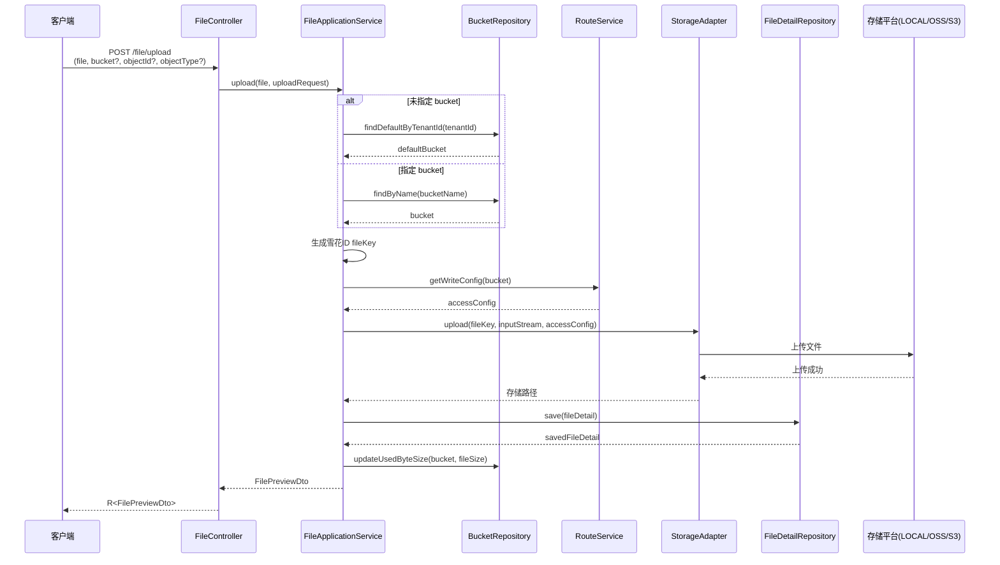

#### 验收标准

1. 当用户上传有效文件内容时，file-app 应将文件保存到配置的存储平台，并返回文件元数据，包括 id、filename、fileType、fileByteSize 和 previewUrl。

2. 当用户上传文件时携带 X-Tenant-Id 请求头，file-app 应将文件与指定租户关联，并在文件记录中存储 tenantId。

3. 当用户上传文件时未指定 bucket，file-app 应使用该租户的默认 bucket。

4. 当用户上传文件时携带 objectId 和 objectType 参数，file-app 应将这些业务关联字段存储在文件记录中。

5. 当用户上传文件时，file-app 应使用雪花ID（Snowflake ID）生成唯一的 fileKey 作为存储路径，以保证索引存储的空间局部性和查询效率。

6. 如果文件上传因存储错误而失败，file-app 应返回错误响应，包含错误码 FILE_UPLOAD_FAILED 和描述性消息。

---

### 3.2 文件下载与预览

#### 需求 2

**用户故事**：作为用户，我希望能够下载或预览已上传的文件，以便访问我存储的内容。

#### 时序图

**文件下载流程**：
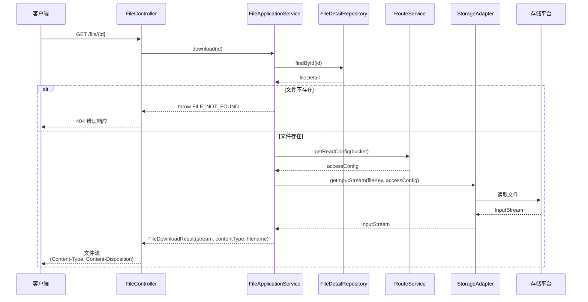

**预览 URL 生成流程**：
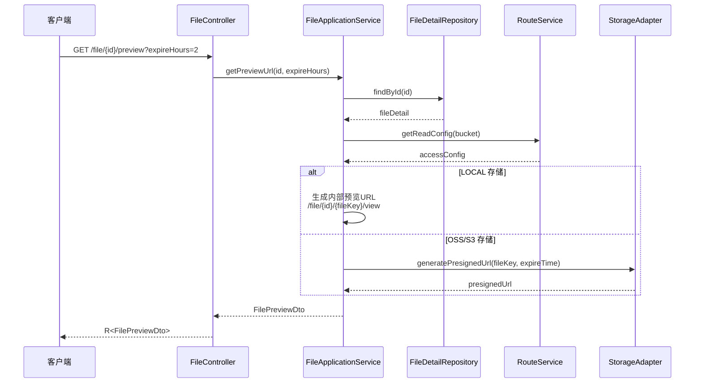

#### 验收标准

1. 当用户通过 id 请求下载文件时，file-app 应以正确的 Content-Type 和 Content-Disposition 头流式传输文件内容。

2. 当用户请求文件的预览 URL 时，file-app 应返回带有可配置过期时间的预签名 URL（默认 2 小时，最长 7 天）。

3. 当用户请求多个文件的预览时，file-app 应返回 FilePreviewDto 列表，包含每个文件的 id、filename、fileType、fileByteSize 和 previewUrl。

4. 如果用户请求不存在的文件，file-app 应返回错误响应，包含错误码 FILE_NOT_FOUND。

5. 当用户通过 view 端点访问文件时，file-app 应验证 fileKey 参数并直接流式传输文件内容。

---

### 3.3 Bucket 管理

#### 需求 3

**用户故事**：作为系统管理员，我希望能够管理存储桶，以便按业务领域组织文件。

#### 时序图

**创建 Bucket 流程**：
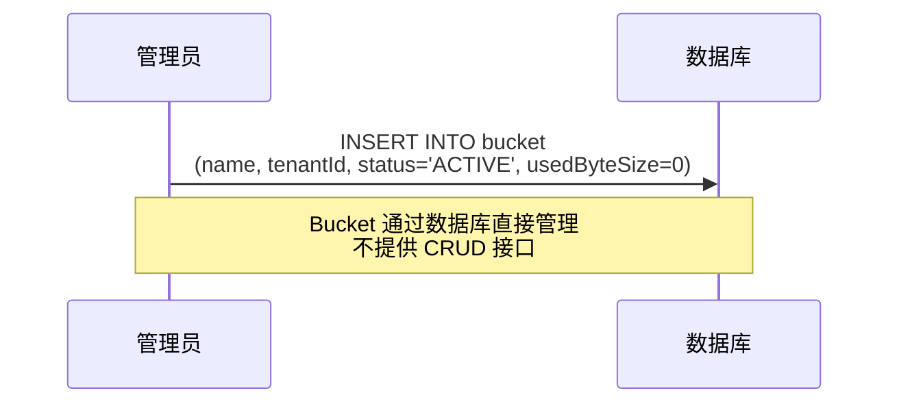

**文件上传时更新 Bucket 容量**：
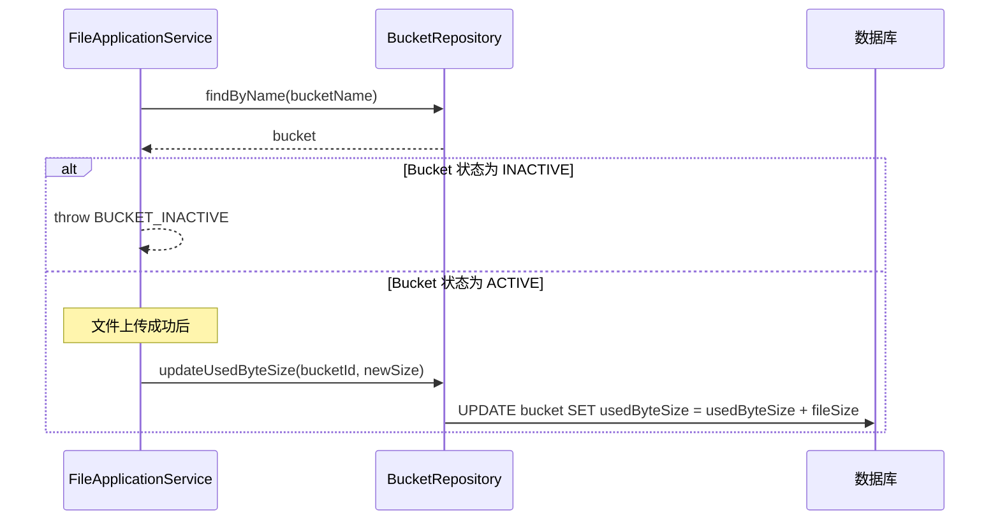

#### 验收标准

1. 当管理员使用 name 和 tenantId 创建 bucket 时，file-app 应创建新的 bucket 记录，状态为 ACTIVE，usedByteSize 初始化为 0。

2. 当管理员查询租户的 bucket 时，file-app 应返回属于该租户的所有活跃 bucket。

3. 当文件上传到 bucket 时，file-app 应更新 bucket 的 usedByteSize 字段以反映新的总量。

4. 如果管理员为同一租户创建重复名称的 bucket，file-app 应返回错误响应，包含错误码 BUCKET_NAME_DUPLICATE。

5. 当管理员禁用 bucket 时，file-app 应将 bucket 状态设置为 INACTIVE，并阻止向该 bucket 上传新文件。

---

### 3.4 访问配置管理

#### 需求 4

**用户故事**：作为系统管理员，我希望能够配置存储平台访问，以便文件可以存储在不同平台（LOCAL/OSS/S3）。

#### 时序图

**路由解析流程（文件上传/下载时）**：
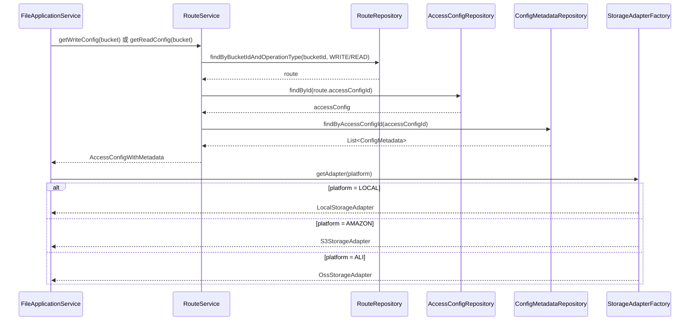

**存储平台配置结构**：
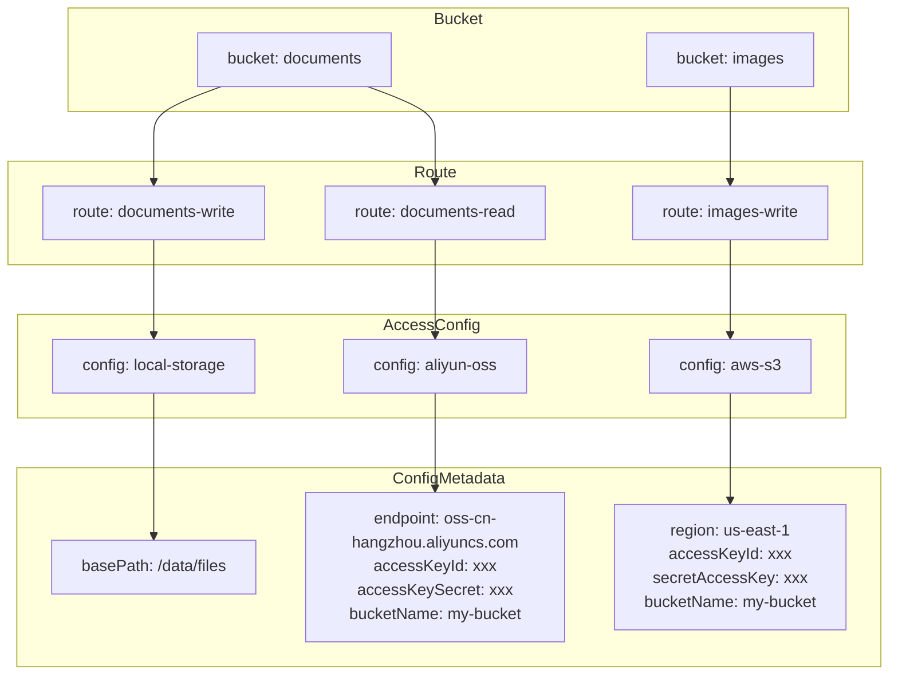

#### 验收标准

1. 当管理员创建访问配置时，file-app 应存储平台类型（AMAZON/ALI/LOCAL）和关联的 ConfigMetadata 条目。

2. 当管理员配置 Amazon S3 访问时，file-app 应在 ConfigMetadata 中存储 accessKeyId、secretAccessKey、region 和 bucketName。

3. 当管理员配置阿里云 OSS 访问时，file-app 应在 ConfigMetadata 中存储 accessKeyId、accessKeySecret、endpoint 和 bucketName。

4. 当管理员配置 LOCAL 存储访问时，file-app 应在 ConfigMetadata 中存储 basePath。

5. 当管理员创建路由时，file-app 应将 bucket 与访问配置关联，用于 READ 或 WRITE 操作。

6. 如果管理员使用无效凭证创建访问配置，file-app 应验证连接性并返回错误响应，包含错误码 ACCESS_CONFIG_INVALID。

---

### 3.5 缩略图生成

#### 需求 5

**用户故事**：作为用户，我希望能够获取图片文件的缩略图，以便在不下载完整文件的情况下预览图片。

#### 时序图

**上传时自动生成缩略图**：
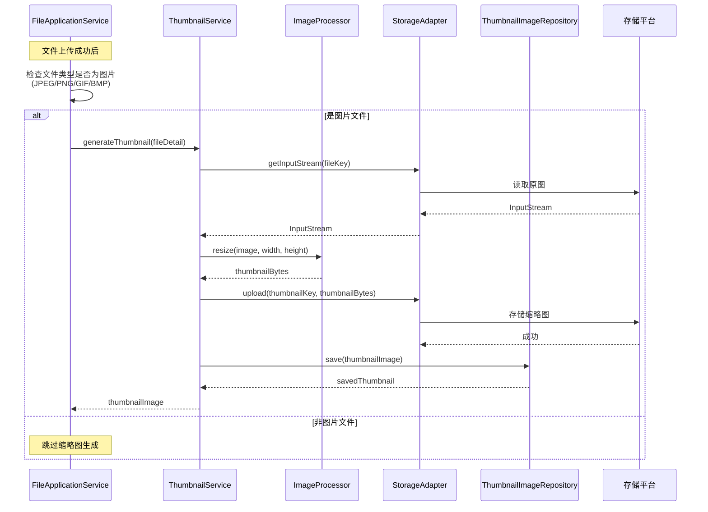

**请求缩略图流程**：
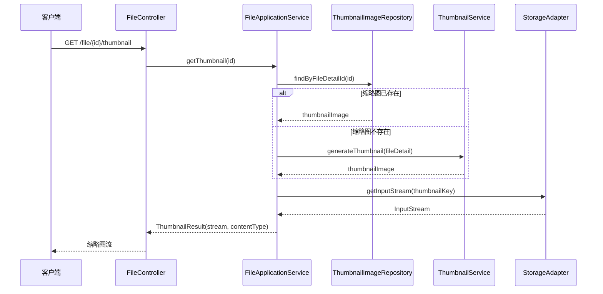

#### 验收标准

1. 当用户上传图片文件（JPEG/PNG/GIF/BMP）时，file-app 应生成可配置尺寸的缩略图。

2. 当用户请求文件的缩略图时，file-app 应返回缩略图图片，如果不存在则生成一个。

3. 当生成缩略图时，file-app 应在 ThumbnailImage 表中存储缩略图元数据，包括 thumbnailName、thumbnailByteSize 和 fileDetailId。

4. 如果用户请求非图片文件的缩略图，file-app 应返回错误响应，包含错误码 THUMBNAIL_NOT_SUPPORTED。

---

### 3.6 水印添加

#### 需求 6

**用户故事**：作为用户，我希望在查看或下载图片时能够添加水印，以便保护我的内容，同时保留原始文件。

#### 时序图

**下载/预览时动态添加水印**：
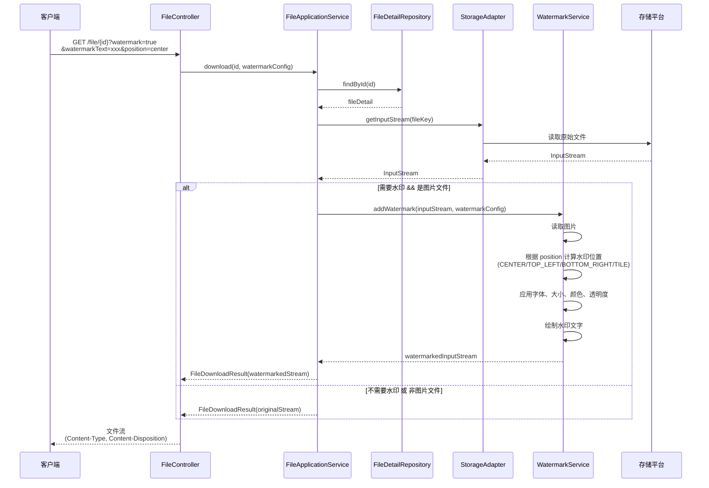

**水印配置参数**：
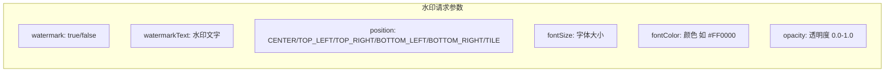

#### 验收标准

1. 当用户请求下载/预览图片时携带水印参数，file-app 应动态为图片添加可配置的文字水印。

2. 当应用水印时，file-app 应根据配置定位水印位置（居中/角落/平铺）。

3. 当应用水印时，file-app 应使用可配置的字体、大小、颜色和透明度设置。

4. 原始文件应保持不变，水印仅在响应流中动态添加。

5. 当用户不携带水印参数时，file-app 应返回原始文件内容。

---

### 3.7 PDF 转图片

#### 需求 7

**用户故事**：作为用户，我希望能够将 PDF 文件转换为图片，以便逐页预览 PDF 内容。

#### 时序图

**同步 PDF 转换流程（直接返回结果）**：
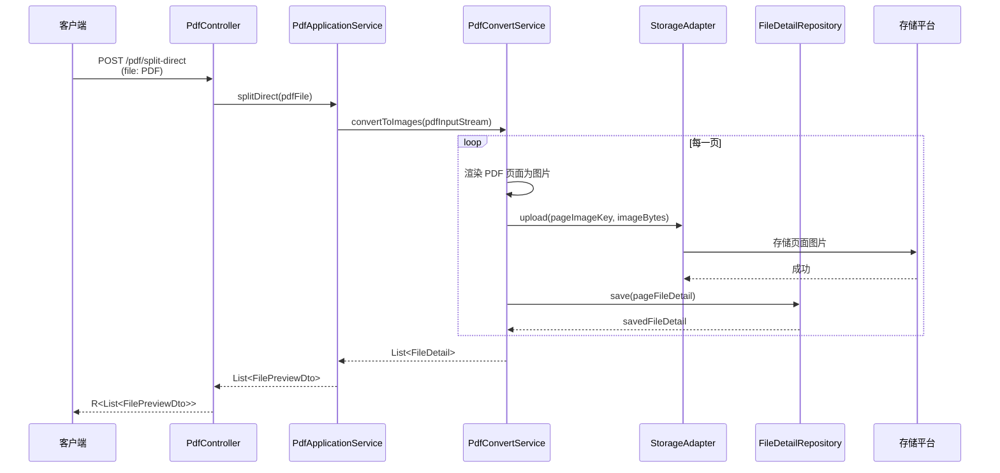

**异步 PDF 拆分任务流程**：
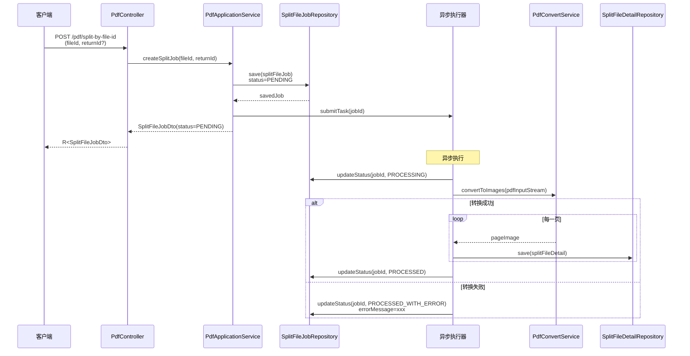

**查询拆分任务状态**：
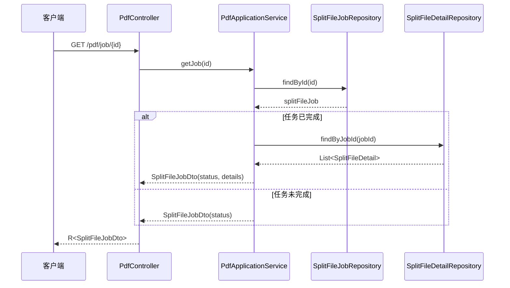

#### 验收标准

1. 当用户上传 PDF 文件并携带 convert 参数时，file-app 应将每一页转换为单独的图片文件。

2. 当 PDF 转换完成时，file-app 应返回每个生成页面图片的 FilePreviewDto 列表。

3. 当用户通过文件 ID 创建拆分文件任务时，file-app 应创建异步任务来拆分 PDF 并返回任务状态。

4. 当用户通过 URL 创建拆分文件任务时，file-app 应从 URL 下载 PDF 并创建拆分任务。

5. 当拆分文件任务完成时，file-app 应将每个页面图片存储为 SplitFileDetail 记录，包含 pageNumber、pageIndex、fileName、fileSize 和 fileType。

6. 当用户查询拆分文件任务时，file-app 应返回任务状态，如果已完成则返回拆分文件详情列表。

7. 如果 PDF 转换失败，file-app 应将任务状态设置为 PROCESSED_WITH_ERROR 并存储错误详情。

---

### 3.8 多租户支持

#### 需求 8

**用户故事**：作为系统运维人员，我希望能够按租户隔离数据，以便每个租户只能访问自己的文件。

#### 时序图

**租户数据隔离流程**：
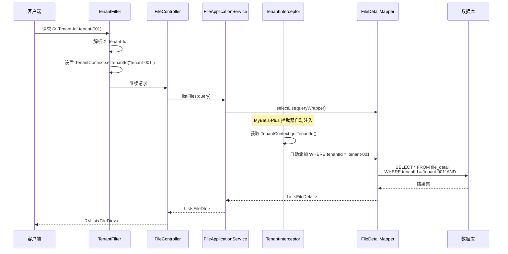

**实体租户隔离注解**：
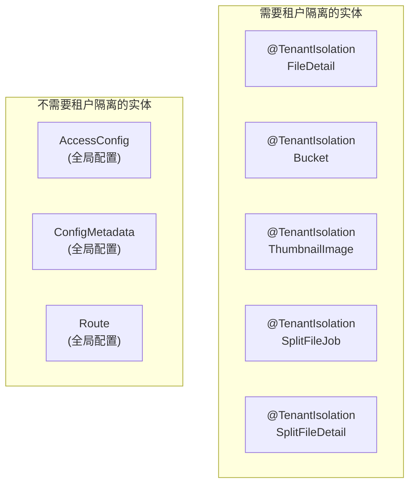

#### 验收标准

1. file-app 应复用 common/xms-core 模块中已有的多租户支持功能，不重复实现。

2. 当查询文件时，file-app 应使用现有的 MyBatis-Plus 租户拦截器自动按 tenantId 过滤结果。

3. 当创建任何实体时，file-app 应使用现有的租户上下文自动设置 tenantId。

4. file-app 的实体类应使用 @TenantIsolation 注解（来自 com.t5.common.annotation）标记需要租户隔离的表。

---

## 4. 非功能需求

### 4.1 性能需求

| 编号 | 需求 | 指标 |
|------|------|------|
| NFR-001 | 单文件上传响应时间 | < 5秒（100MB 文件） |
| NFR-002 | 文件下载吞吐量 | 支持 100 并发下载 |
| NFR-003 | 预览 URL 生成响应时间 | < 200ms |
| NFR-004 | 批量预览查询响应时间 | < 500ms（100 个文件） |

### 4.2 安全需求

| 编号 | 需求 | 描述 |
|------|------|------|
| NFR-005 | 文件类型校验 | 可配置允许的文件类型白名单 |
| NFR-006 | 文件大小限制 | 可配置单文件和请求总大小限制 |
| NFR-007 | 路径安全 | 防止路径遍历攻击 |
| NFR-008 | 预签名 URL 安全 | URL 包含签名和过期时间 |
| NFR-009 | 租户隔离 | 严格的数据隔离，防止跨租户访问 |

### 4.3 可用性需求

| 编号 | 需求 | 描述 |
|------|------|------|
| NFR-010 | 存储目录自动创建 | 目录不存在时自动创建 |
| NFR-011 | 文件名冲突处理 | 使用雪花ID fileKey 避免冲突 |
| NFR-012 | 错误信息友好 | 返回清晰的错误码和消息 |
| NFR-013 | 异步任务重试 | PDF 拆分任务支持重试机制 |

---

## 5. 约束条件

### 5.1 技术约束

| 约束 | 描述 |
|------|------|
| 存储平台 | 支持 LOCAL、AMAZON S3、ALI OSS |
| 技术栈 | Spring Boot 3.x + Java 21 |
| ORM | MyBatis-Plus |
| 对象映射 | MapStruct |
| 架构模式 | DDD 分层架构（rest/application/domain/infrastructure） |

### 5.2 业务约束

| 约束 | 描述 |
|------|------|
| 文件ID | 使用 Long 类型自增主键 |
| 租户ID | 通过 X-Tenant-Id 请求头传递 |
| 表结构 | 使用 file_detail 表结构（来自 file-backend），字段名改为驼峰命名 |
| API 风格 | 使用 /file 前缀，方法级别完整路径（禁止类级别 @RequestMapping） |

### 5.3 迁移适配约束

| 约束 | 描述 |
|------|------|
| 数据库字段命名 | 改为驼峰命名（如 fileName、createdTime），符合 wms-lite-backend-2 规范 |
| 时间类型 | 从 Instant 改为 LocalDateTime，使用 TimeZones.now() 获取当前时间 |
| 租户隔离注解 | 使用 @TenantIsolation（来自 com.t5.common.annotation），不迁移 @TenantTable |
| 实体类注解 | @TableName 必须包含 autoResultMap = true |
| Bucket/AccessConfig 管理 | 仅通过配置文件或数据库直接管理，不提供 CRUD 接口 |
| 异步通知 | 暂不实现，PDF拆分任务完成后不发送通知消息 |

### 5.4 数据库表结构

以 file-backend 的表结构为准（字段名改为驼峰命名），包括：
- `bucket` - 存储桶表
- `file_detail` - 文件详情表
- `access_config` - 访问配置表
- `config_metadata` - 配置元数据表
- `route` - 路由配置表
- `thumbnail_image` - 缩略图表
- `operation_log` - 操作日志表
- `split_file_job` - PDF 拆分任务表
- `split_file_detail` - PDF 拆分文件明细表

---

## 6. 验收标准

### 6.1 功能验收

- [ ] 文件上传/下载/预览 API 全部实现
- [ ] 多存储平台（LOCAL/OSS/S3）支持
- [ ] Bucket 管理功能
- [ ] 访问配置管理功能
- [ ] 缩略图生成功能
- [ ] 水印添加功能
- [ ] PDF 转图片功能
- [ ] 多租户数据隔离

### 6.2 非功能验收

- [ ] 100MB 文件上传成功
- [ ] 并发下载测试通过
- [ ] 安全测试通过（路径遍历、租户隔离）
- [ ] 异步任务重试机制验证

### 6.3 代码规范验收

- [ ] Controller 层使用 OpenAPI 注解（@Operation、@Parameter、@Tag 等）
- [ ] 代码注释完整清晰

---

## 7. API 接口总览

### 7.1 文件操作接口 `/file`

| 方法 | 路径 | 功能 |
|------|------|------|
| POST | `/file/upload` | 单文件上传 |
| GET | `/file/{id}` | 文件下载 |
| GET | `/file/{id}/preview` | 获取预览 URL |
| POST | `/file/preview` | 批量获取预览 URL |
| POST | `/file/pdf-convert` | 上传 PDF 并转换为图片 |
| GET | `/file/{id}/{fileKey}/view` | 直接查看文件 |

### 7.2 PDF 拆分接口 `/pdf`

| 方法 | 路径 | 功能 |
|------|------|------|
| POST | `/pdf/split` | 上传 PDF 并创建拆分任务 |
| POST | `/pdf/split-by-file-id` | 按文件 ID 创建拆分任务 |
| POST | `/pdf/split-by-url` | 按 URL 创建拆分任务 |
| POST | `/pdf/split-direct` | 直接拆分并返回结果 |
| GET | `/pdf/job/{id}` | 查询拆分任务 |
| GET | `/pdf/job/file/{fileId}` | 按文件 ID 查询任务 |
| GET | `/pdf/job/return/{returnId}` | 按 returnId 查询任务 |
| GET | `/pdf/job/{id}/retry-processing` | 重试处理中的任务 |
