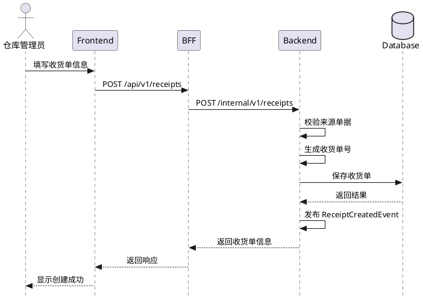
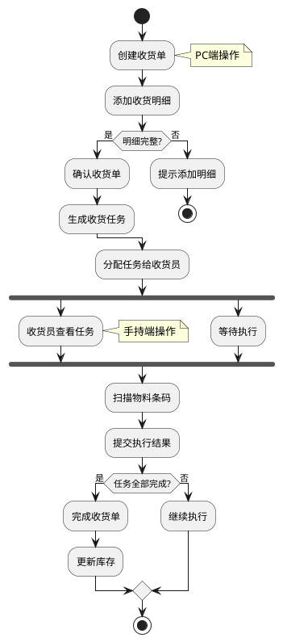
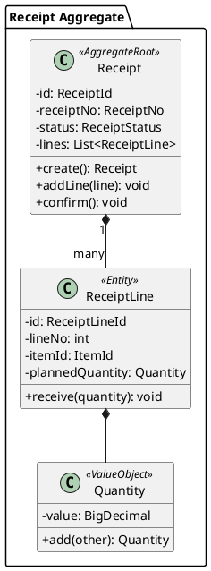
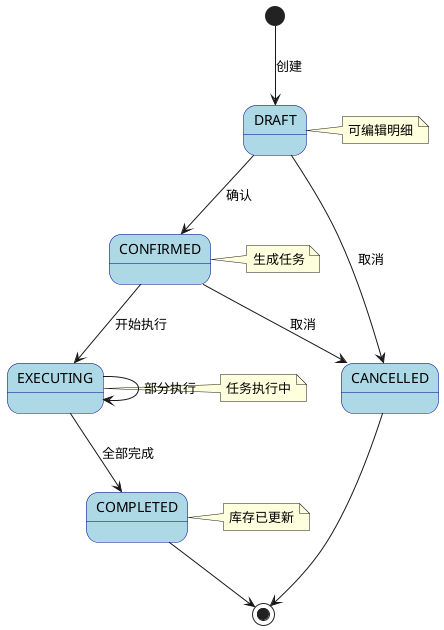
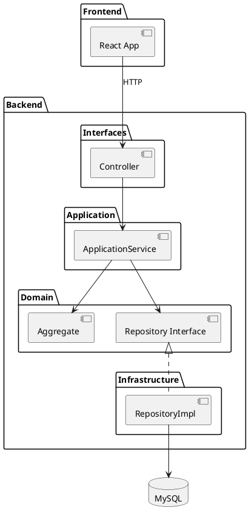

# PlantUML 绘图规范

---

## 1. 文件组织

### 1.1 双重存储

PlantUML 图表需要同时存在于两个位置：
- design.md 内嵌 - 使用 Markdown 代码块嵌入，便于阅读
- 独立 .puml 文件 - 在 diagrams/ 目录下，便于版本管理和工具渲染

### 1.2 目录结构

```
.kiro/specs/{feature-name}/
├── design.md
└── diagrams/
    ├── 01-system-architecture.puml
    ├── 02-create-receipt-sequence.puml
    ├── 03-confirm-receipt-sequence.puml
    ├── 04-business-flow-activity.puml
    ├── 05-receipt-aggregate-class.puml
    ├── 06-receipt-state.puml
    └── ...
```

### 1.3 文件命名规范

- 序号前缀：两位数字，便于排序（01-, 02-）
- 图类型后缀：标识图表类型
  - -sequence（时序图）
  - -activity（活动图）
  - -class（类图）
  - -state（状态图）
  - -component（组件图）
- 小写连字符：使用小写字母和连字符
- 扩展名：.puml

示例：
- 01-system-architecture.puml
- 02-create-receipt-sequence.puml
- 05-receipt-aggregate-class.puml

---

## 2. 必须包含的图表类型

### 2.1 时序图（Sequence）

适用场景：API 调用流程、多系统协作、组件间交互顺序

必须包含：
- 核心业务流程的 API 调用链
- 多端协作流程（PC端、手持端、后端）

### 2.2 活动图（Activity）

适用场景：业务流程步骤、决策分支、并行处理

必须包含：
- 主要业务流程的完整步骤
- 分支条件和异常处理

### 2.3 类图（Class）

适用场景：聚合结构、实体关系、值对象组成

必须包含：
- 每个聚合的内部结构
- 聚合根、实体、值对象的关系

### 2.4 状态图（State）

适用场景：单据状态流转、状态机

必须包含：
- 所有状态及转换条件
- 初始状态和终止状态

### 2.5 组件图（Component）

适用场景：系统架构、分层结构、模块依赖

必须包含：
- 系统整体架构
- 各层之间的依赖关系

---

## 3. 通用样式规范

### 3.1 基础样式设置

```plantuml
' 通用样式
skinparam style strictuml
skinparam backgroundColor white
skinparam defaultFontName "Microsoft YaHei"
skinparam defaultFontSize 12
```

### 3.2 时序图样式

```plantuml
skinparam sequenceMessageAlign center
skinparam sequenceArrowThickness 1
skinparam participantPadding 20
skinparam boxPadding 10
```

### 3.3 类图样式

```plantuml
skinparam classAttributeIconSize 0
skinparam classFontStyle bold
skinparam classBackgroundColor White
skinparam classBorderColor Black
```

### 3.4 活动图样式

```plantuml
skinparam activityShape roundedBox
skinparam activityBorderColor DarkBlue
skinparam activityBackgroundColor LightBlue
```

### 3.5 状态图样式

```plantuml
skinparam state {
  BackgroundColor LightBlue
  BorderColor DarkBlue
  FontColor Black
}
```

---

## 4. 独立文件模板

每个 .puml 文件必须包含文件头注释：

```plantuml
@startuml 图表标题
' ============================================
' 文件：{filename}.puml
' 功能：{功能名称}
' 描述：{图表描述}
' 作者：{作者}
' 日期：{创建日期}
' ============================================

' 样式设置
skinparam style strictuml
skinparam defaultFontName "Microsoft YaHei"

' 图表内容
...

@enduml
```



---

## 5. 时序图编写规范

### 5.1 参与者定义

```plantuml
actor "用户角色" as User
participant "前端" as FE
participant "BFF" as BFF
participant "后端" as BE
database "数据库" as DB
queue "消息队列" as MQ
```

### 5.2 消息格式

- 同步调用：->
- 异步调用：->>
- 返回：-->
- 自调用：-> 自己

### 5.3 分组和注释

```plantuml
group 业务逻辑
  BE -> BE: 校验数据
  BE -> DB: 保存数据
end

note right of BE: 这里是注释
```

### 5.4 示例



---

## 6. 活动图编写规范

### 6.1 基本元素

- start / stop - 开始/结束
- :动作; - 动作节点
- if / else / endif - 条件分支
- fork / end fork - 并行分支
- note right/left - 注释

### 6.2 条件分支

```plantuml
if (条件?) then (是)
  :执行动作A;
else (否)
  :执行动作B;
endif
```

### 6.3 并行处理

```plantuml
fork
  :并行任务1;
fork again
  :并行任务2;
end fork
```

### 6.4 示例



---

## 7. 类图编写规范

### 7.1 类定义

```plantuml
class ClassName <<Stereotype>> {
  - privateField: Type
  + publicMethod(): ReturnType
}
```

### 7.2 常用构造型（Stereotype）

- <<AggregateRoot>> - 聚合根
- <<Entity>> - 实体
- <<ValueObject>> - 值对象
- <<DomainService>> - 领域服务
- <<Repository>> - 仓储

### 7.3 关系表示

- 组合：*--（强拥有，生命周期一致）
- 聚合：o--（弱拥有）
- 关联：--
- 依赖：..>
- 实现：..|>
- 继承：--|>

### 7.4 示例



---

## 8. 状态图编写规范

### 8.1 基本元素

- [*] - 初始/终止状态
- STATE_NAME - 状态
- --> - 状态转换
- note - 注释

### 8.2 转换标签

```plantuml
STATE1 --> STATE2 : 触发事件
```

### 8.3 示例



---

## 9. 组件图编写规范

### 9.1 基本元素

```plantuml
package "包名" {
  [组件名] as Alias
}

database "数据库" as DB
queue "消息队列" as MQ
```

### 9.2 连接关系

- --> 依赖
- ..> 虚线依赖
- <|.. 实现

### 9.3 示例



---

## 10. 检查清单

图表完整性：
- [ ] 包含系统架构组件图
- [ ] 包含核心业务时序图
- [ ] 包含业务流程活动图
- [ ] 包含聚合类图
- [ ] 包含状态流转图（如有状态机）

文件规范：
- [ ] 文件命名符合规范
- [ ] 包含文件头注释
- [ ] 样式设置统一

语法正确性：
- [ ] PlantUML 语法正确
- [ ] 图表标题清晰
- [ ] 注释说明完整

