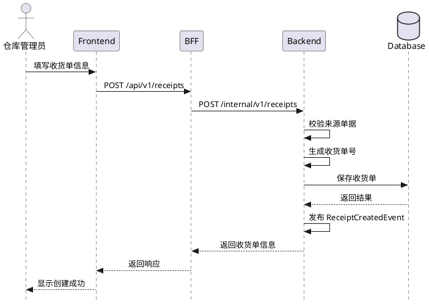
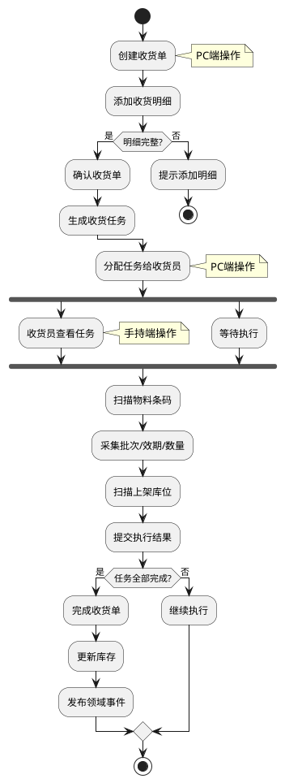
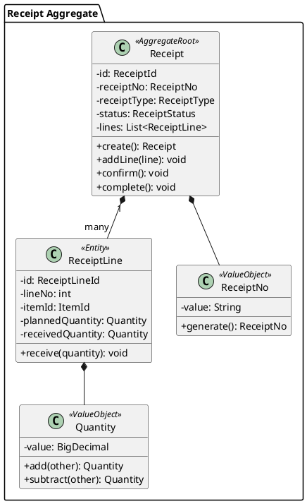
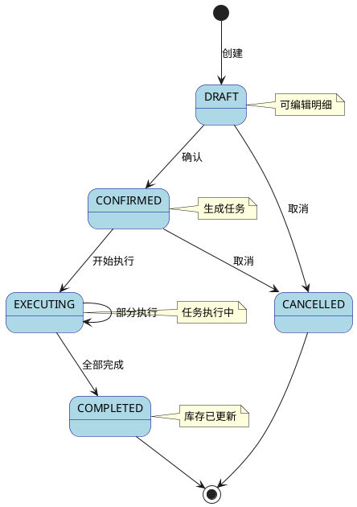

# 技术设计编写规范（Design Guidelines）

## 概述

本规范定义了技术设计（Design）的编写标准，基于领域模型进行技术实现方案设计。

### 相关规范

- **领域建模规范**：参见 `domain-model-guidelines.md`
- **DDD 架构规范**：参见 `ddd-architecture.md`
- **技术架构规范**：参见 `tech-stack.md`
- **TDD 工作流程**：参见 `test-driven-development-workflow.md`

---

## 文件位置

```
.kiro/specs/{feature-name}/design.md
```

---

## 模板结构

```markdown
# {功能名称} - 技术设计

## 1. 概述

## 2. 架构设计

## 3. 流程图（PlantUML）

## 4. API 设计

## 5. 数据模型

## 6. 领域对象映射

## 7. 错误处理

## 8. 安全设计

## 9. 性能考虑
```

---

## 1. 概述

简要描述技术实现方案，包括：
- 实现目标
- 技术选型依据
- 关键设计决策

```markdown
## 1. 概述

本设计基于领域模型实现仓库收货功能，采用 DDD 四层架构：
- **后端**：Spring Boot + MyBatis-Plus
- **BFF**：NestJS
- **前端**：React + Ant Design
- **移动端**：Flutter

关键设计决策：
1. 统一 Receipt 聚合承载所有收货类型
2. 任务驱动模式支持手持端执行
3. 事件驱动实现聚合间通信
```

---

## 2. 架构设计

### 2.1 分层结构

```markdown
### 2.1 分层结构

```
┌─────────────────────────────────────────────────────────────┐
│                    Interfaces 接口层                         │
│              (Controller / DTO / Assembler)                 │
├─────────────────────────────────────────────────────────────┤
│                   Application 应用层                         │
│                (ApplicationService / Command / Query)        │
├─────────────────────────────────────────────────────────────┤
│                     Domain 领域层                            │
│    (Entity / ValueObject / Aggregate / DomainService /      │
│     Repository接口 / DomainEvent)                           │
├─────────────────────────────────────────────────────────────┤
│                 Infrastructure 基础设施层                    │
│      (RepositoryImpl / Gateway / Config / Messaging)        │
└─────────────────────────────────────────────────────────────┘
```
```

### 2.2 模块依赖

```markdown
### 2.2 模块依赖

| 模块 | 依赖 | 说明 |
|-----|------|------|
| interfaces | application | 调用应用服务 |
| application | domain | 编排领域对象 |
| domain | 无 | 核心，不依赖其他层 |
| infrastructure | domain | 实现领域层接口 |
```

### 2.3 包结构

```markdown
### 2.3 包结构

```
com.wms.receiving/
├── interfaces/
│   ├── controller/
│   │   ├── ReceiptController.java
│   │   └── ReceivingTaskController.java
│   ├── dto/
│   │   ├── request/
│   │   └── response/
│   └── assembler/
├── application/
│   ├── service/
│   │   ├── ReceiptApplicationService.java
│   │   └── ReceivingTaskApplicationService.java
│   ├── command/
│   └── query/
├── domain/
│   ├── model/
│   │   ├── receipt/
│   │   └── task/
│   ├── service/
│   ├── repository/
│   └── event/
└── infrastructure/
    ├── persistence/
    ├── messaging/
    └── config/
```
```

---

## 3. 流程图（PlantUML）

设计阶段必须使用 PlantUML 绘制关键流程图，便于团队理解和评审。

### 3.1 文件组织

PlantUML 图表需要同时存在于两个位置：

1. **design.md 内嵌**：在设计文档中使用 Markdown 代码块嵌入，便于阅读
2. **独立 .puml 文件**：在 `diagrams/` 目录下生成独立文件，便于版本管理和工具渲染

```
.kiro/specs/{feature-name}/
├── design.md                    # 设计文档（内嵌 PlantUML）
├── diagrams/                    # PlantUML 独立文件目录
│   ├── 01-system-architecture.puml      # 系统架构组件图
│   ├── 02-create-receipt-sequence.puml  # 创建收货单时序图
│   ├── 03-confirm-receipt-sequence.puml # 确认收货单时序图
│   ├── 04-execute-task-sequence.puml    # 执行任务时序图
│   ├── 05-business-flow-activity.puml   # 业务流程活动图
│   ├── 06-receipt-aggregate-class.puml  # Receipt聚合类图
│   ├── 07-task-aggregate-class.puml     # Task聚合类图
│   ├── 08-receipt-state.puml            # Receipt状态图
│   ├── 09-task-state.puml               # Task状态图
│   ├── 10-event-storming.puml           # 事件风暴图
│   └── 11-multi-terminal-flow.puml      # 多端协作流程图
│   └── ...
```

### 3.2 文件命名规范

| 规则 | 说明 | 示例 |
|-----|------|------|
| 序号前缀 | 两位数字序号，便于排序 | `01-`, `02-` |
| 图类型后缀 | 标识图表类型 | `-sequence`, `-activity`, `-class`, `-state` |
| 小写连字符 | 使用小写字母和连字符 | `create-receipt-sequence.puml` |
| 扩展名 | 使用 `.puml` 扩展名 | `xxx.puml` |

### 3.3 必须包含的流程图

| 图类型 | 说明 | 适用场景 |
|-------|------|---------|
| 时序图 | 展示组件间交互顺序 | API 调用流程、多系统协作 |
| 活动图 | 展示业务流程步骤 | 业务流程、状态流转 |
| 类图 | 展示领域模型结构 | 聚合、实体、值对象关系 |
| 组件图 | 展示系统架构 | 分层架构、模块依赖 |
| 状态图 | 展示状态机 | 单据状态流转 |

### 3.2 PlantUML 时序图示例

```markdown
### 3.2.1 创建收货单时序图


```

### 3.3 PlantUML 活动图示例

```markdown
### 3.3.1 收货业务流程活动图


```

### 3.4 PlantUML 类图示例

```markdown
### 3.4.1 收货聚合类图


```

### 3.5 PlantUML 状态图示例

```markdown
### 3.5.1 收货单状态流转图


```

### 3.6 PlantUML 组件图示例

```markdown
### 3.6.1 系统架构组件图

```plantuml
@startuml 系统架构
skinparam componentStyle uml2

package "Frontend" {
  [React App] as FE
}

package "Mobile" {
  [Flutter App] as Mobile
}

package "BFF Layer" {
  [NestJS BFF] as BFF
}

package "Backend" {
  package "Interfaces" {
    [Controller] as Ctrl
  }
  package "Application" {
    [ApplicationService] as AppSvc
  }
  package "Domain" {
    [Aggregate] as Agg
    [DomainService] as DomSvc
    [Repository Interface] as RepoIF
  }
  package "Infrastructure" {
    [RepositoryImpl] as RepoImpl
    [Messaging] as Msg
  }
}

database "MySQL" as DB
queue "RabbitMQ" as MQ
database "Redis" as Cache

FE --> BFF : HTTP
Mobile --> BFF : HTTP
BFF --> Ctrl : HTTP

Ctrl --> AppSvc
AppSvc --> Agg
AppSvc --> DomSvc
AppSvc --> RepoIF
RepoIF <|.. RepoImpl
RepoImpl --> DB
AppSvc --> Msg
Msg --> MQ
RepoImpl --> Cache

@enduml
```
```

### 3.7 PlantUML 编写规范

| 规范 | 说明 |
|-----|------|
| 文件格式 | 使用 Markdown 代码块，语言标记为 `plantuml` |
| 图标题 | 使用 `@startuml 图标题` 指定 |
| 皮肤设置 | 使用 `skinparam` 统一样式 |
| 中文支持 | PlantUML 原生支持中文 |
| 注释 | 使用 `note` 添加说明 |

### 3.8 PlantUML 样式模板

```plantuml
' 通用样式设置
skinparam style strictuml
skinparam backgroundColor white
skinparam defaultFontName "Microsoft YaHei"
skinparam defaultFontSize 12

' 时序图样式
skinparam sequenceMessageAlign center
skinparam sequenceArrowThickness 1

' 类图样式
skinparam classAttributeIconSize 0
skinparam classFontStyle bold

' 活动图样式
skinparam activityShape roundedBox
skinparam activityBorderColor DarkBlue

' 状态图样式
skinparam state {
  BackgroundColor LightBlue
  BorderColor DarkBlue
}
```

### 3.9 独立文件模板

每个 `.puml` 文件应包含完整的 PlantUML 定义：


---

## 4. API 设计

### 4.1 BFF 层 API

```markdown
### 4.1 BFF 层 API

#### 收货单 API

| 方法 | 路径 | 说明 | 请求体 | 响应体 |
|-----|------|------|-------|-------|
| POST | /api/v1/receipts | 创建收货单 | CreateReceiptRequest | ReceiptResponse |
| GET | /api/v1/receipts/{id} | 查询收货单 | - | ReceiptDetailResponse |
| GET | /api/v1/receipts | 查询收货单列表 | Query Params | PageResponse<ReceiptResponse> |
| PUT | /api/v1/receipts/{id}/confirm | 确认收货单 | - | ReceiptResponse |
| PUT | /api/v1/receipts/{id}/complete | 完成收货单 | - | ReceiptResponse |

#### 收货任务 API

| 方法 | 路径 | 说明 | 请求体 | 响应体 |
|-----|------|------|-------|-------|
| GET | /api/v1/tasks | 查询任务列表 | Query Params | PageResponse<TaskResponse> |
| GET | /api/v1/tasks/{id} | 查询任务详情 | - | TaskDetailResponse |
| PUT | /api/v1/tasks/{id}/assign | 分配任务 | AssignTaskRequest | TaskResponse |
| POST | /api/v1/tasks/{id}/execute | 执行任务 | ExecuteTaskRequest | TaskExecutionResponse |
| PUT | /api/v1/tasks/{id}/complete | 完成任务 | - | TaskResponse |
```

### 4.2 后端 API

```markdown
### 4.2 后端 API

BFF 调用的后端接口，路径前缀 `/internal/v1`。

| 方法 | 路径 | 说明 |
|-----|------|------|
| POST | /internal/v1/receipts | 创建收货单 |
| GET | /internal/v1/receipts/{id} | 查询收货单 |
| ... | ... | ... |
```

### 4.3 请求/响应示例

```markdown
### 4.3 请求/响应示例

#### 创建收货单

**请求**：
```json
{
  "receiptType": "ASN",
  "sourceDocumentId": "asn-001",
  "sourceDocumentNo": "ASN20241231001",
  "warehouseId": "wh-001",
  "lines": [
    {
      "itemId": "item-001",
      "plannedQuantity": 100,
      "sscc": "123456789012345678"
    }
  ]
}
```

**响应**：
```json
{
  "code": 200,
  "message": "success",
  "data": {
    "id": "rcv-001",
    "receiptNo": "RCV20241231000001",
    "status": "DRAFT",
    ...
  }
}
```
```

---

## 5. 数据模型

### 5.1 数据库表设计

```markdown
### 5.1 数据库表设计

#### wms_receipt（收货单主表）

| 字段 | 类型 | 说明 | 约束 |
|-----|------|------|------|
| id | VARCHAR(36) | 主键 | PK |
| receipt_no | VARCHAR(32) | 收货单号 | UNIQUE, NOT NULL |
| receipt_type | VARCHAR(16) | 收货类型 | NOT NULL |
| source_document_id | VARCHAR(36) | 来源单据ID | |
| source_document_no | VARCHAR(32) | 来源单据号 | |
| source_type | VARCHAR(16) | 来源类型 | |
| supplier_id | VARCHAR(36) | 供应商ID | |
| customer_id | VARCHAR(36) | 客户ID | |
| warehouse_id | VARCHAR(36) | 仓库ID | NOT NULL |
| status | VARCHAR(16) | 状态 | NOT NULL |
| received_by | VARCHAR(36) | 收货人 | |
| received_at | DATETIME | 收货时间 | |
| ext1 ~ ext10 | VARCHAR(255) | 扩展字段 | |
| created_at | DATETIME | 创建时间 | NOT NULL |
| updated_at | DATETIME | 更新时间 | NOT NULL |
| created_by | VARCHAR(36) | 创建人 | |
| updated_by | VARCHAR(36) | 更新人 | |

#### wms_receipt_line（收货单明细表）

| 字段 | 类型 | 说明 | 约束 |
|-----|------|------|------|
| id | VARCHAR(36) | 主键 | PK |
| receipt_id | VARCHAR(36) | 收货单ID | FK, NOT NULL |
| line_no | INT | 行号 | NOT NULL |
| item_id | VARCHAR(36) | 物料ID | NOT NULL |
| item_code | VARCHAR(32) | 物料编码 | NOT NULL |
| item_name | VARCHAR(128) | 物料名称 | |
| planned_quantity | DECIMAL(18,4) | 计划数量 | NOT NULL |
| received_quantity | DECIMAL(18,4) | 实收数量 | DEFAULT 0 |
| sscc | VARCHAR(18) | SSCC码 | |
| return_reason_code | VARCHAR(16) | 退货原因代码 | |
| require_qc | TINYINT | 是否需要质检 | |
| qc_status | VARCHAR(16) | 质检状态 | |
| qc_result | VARCHAR(16) | 质检结果 | |
| disposition | VARCHAR(16) | 最终处置 | |
| status | VARCHAR(16) | 明细状态 | NOT NULL |
| line_ext1 ~ line_ext10 | VARCHAR(255) | 行扩展字段 | |

#### wms_receiving_task（收货任务表）

| 字段 | 类型 | 说明 | 约束 |
|-----|------|------|------|
| id | VARCHAR(36) | 主键 | PK |
| task_no | VARCHAR(32) | 任务编号 | UNIQUE, NOT NULL |
| receipt_id | VARCHAR(36) | 收货单ID | FK, NOT NULL |
| receipt_line_id | VARCHAR(36) | 收货明细ID | FK, NOT NULL |
| task_type | VARCHAR(16) | 任务类型 | NOT NULL |
| warehouse_id | VARCHAR(36) | 仓库ID | NOT NULL |
| item_id | VARCHAR(36) | 物料ID | NOT NULL |
| planned_quantity | DECIMAL(18,4) | 计划数量 | NOT NULL |
| executed_quantity | DECIMAL(18,4) | 已执行数量 | DEFAULT 0 |
| status | VARCHAR(16) | 状态 | NOT NULL |
| assigned_to | VARCHAR(36) | 分配给谁 | |
| assigned_at | DATETIME | 分配时间 | |
| ext1 ~ ext10 | VARCHAR(255) | 扩展字段 | |

#### wms_task_execution（任务执行记录表）

| 字段 | 类型 | 说明 | 约束 |
|-----|------|------|------|
| id | VARCHAR(36) | 主键 | PK |
| task_id | VARCHAR(36) | 任务ID | FK, NOT NULL |
| execution_no | INT | 执行序号 | NOT NULL |
| executed_quantity | DECIMAL(18,4) | 执行数量 | NOT NULL |
| batch | VARCHAR(50) | 批次号 | |
| expiry_date | DATE | 效期 | |
| location_id | VARCHAR(36) | 库位ID | NOT NULL |
| location_code | VARCHAR(32) | 库位编码 | |
| executed_by | VARCHAR(36) | 执行人 | NOT NULL |
| executed_at | DATETIME | 执行时间 | NOT NULL |
| remark | VARCHAR(512) | 备注 | |
```

### 5.2 索引设计

```markdown
### 5.2 索引设计

#### wms_receipt
- idx_receipt_no (receipt_no)
- idx_source_document (source_document_id, source_type)
- idx_status (status)
- idx_warehouse_date (warehouse_id, created_at)

#### wms_receiving_task
- idx_task_no (task_no)
- idx_receipt (receipt_id)
- idx_assignee_status (assigned_to, status)
- idx_warehouse_status (warehouse_id, status)
```

---

## 6. 领域对象映射

### 6.1 Entity ↔ PO 映射

```markdown
### 6.1 Entity ↔ PO 映射

| Entity | PO | Converter |
|--------|-----|-----------|
| Receipt | ReceiptPO + ReceiptLinePO | ReceiptConverter |
| ReceivingTask | ReceivingTaskPO + TaskExecutionPO | ReceivingTaskConverter |

#### 映射规则

1. 聚合根对应主表 PO
2. 聚合内实体对应子表 PO
3. 值对象展开为 PO 字段
4. 枚举存储为字符串
```

### 6.2 DTO ↔ Entity 映射

```markdown
### 6.2 DTO ↔ Entity 映射

| DTO | Entity | Assembler |
|-----|--------|-----------|
| CreateReceiptRequest | Receipt | ReceiptAssembler |
| ReceiptResponse | Receipt | ReceiptAssembler |
| ExecuteTaskRequest | TaskExecution | TaskAssembler |
```

---

## 7. 错误处理

```markdown
## 7. 错误处理

### 7.1 错误码设计

| 错误码 | 说明 | HTTP 状态码 |
|-------|------|------------|
| RCV_001 | 收货单不存在 | 404 |
| RCV_002 | 收货单状态不允许此操作 | 400 |
| RCV_003 | SSCC 已被收货 | 400 |
| RCV_004 | 收货数量超出容差范围 | 400 |
| RCV_005 | 物料不在来源单据中 | 400 |
| TSK_001 | 任务不存在 | 404 |
| TSK_002 | 任务未分配 | 400 |
| TSK_003 | 任务已完成 | 400 |
| TSK_004 | 批次号必填 | 400 |
| TSK_005 | 序列号必填 | 400 |

### 7.2 异常类设计

| 异常类 | 说明 |
|-------|------|
| ReceiptNotFoundException | 收货单不存在 |
| InvalidReceiptStatusException | 收货单状态无效 |
| DuplicateSSCCException | SSCC 重复 |
| ToleranceExceededException | 超出容差 |
| TaskNotFoundException | 任务不存在 |
| TaskNotAssignedException | 任务未分配 |
```

---

## 8. 安全设计

```markdown
## 8. 安全设计

### 8.1 权限控制

| 操作 | 所需权限 | 角色 |
|-----|---------|------|
| 创建收货单 | receipt:create | 仓库管理员 |
| 确认收货单 | receipt:confirm | 仓库管理员 |
| 执行任务 | task:execute | 收货员 |
| 查看任务 | task:view | 收货员、仓库管理员 |

### 8.2 数据权限

- 收货员只能看到分配给自己的任务
- 仓库管理员可以看到本仓库所有数据
```

---

## 9. 性能考虑

```markdown
## 9. 性能考虑

### 9.1 缓存策略

| 数据 | 缓存位置 | TTL | 说明 |
|-----|---------|-----|------|
| 收货配置 | Redis | 5min | 容差、上架策略等 |
| 物料信息 | Redis | 10min | 物料基本信息 |
| 库位信息 | Redis | 10min | 库位基本信息 |

### 9.2 批量处理

- 任务生成：批量插入
- 库存更新：批量更新
- 事件发布：批量发布

### 9.3 异步处理

- 库存更新：通过消息队列异步处理
- 通知推送：通过消息队列异步处理
```

---

## 检查清单

### 架构设计
- [ ] 分层结构清晰
- [ ] 模块依赖正确（上层依赖下层）
- [ ] 包结构符合 DDD 规范

### 流程图（PlantUML）
- [ ] 包含核心业务流程时序图
- [ ] 包含业务流程活动图
- [ ] 包含领域模型类图
- [ ] 包含状态流转图（如有状态机）
- [ ] PlantUML 语法正确
- [ ] 图表标题清晰
- [ ] 生成独立 .puml 文件到 diagrams/ 目录
- [ ] 文件命名符合规范（序号+类型后缀）

### API 设计
- [ ] RESTful 风格
- [ ] 请求/响应格式统一
- [ ] 包含必要的示例

### 数据模型
- [ ] 表结构完整
- [ ] 字段类型合理
- [ ] 索引设计合理
- [ ] 扩展字段预留

### 映射关系
- [ ] Entity ↔ PO 映射清晰
- [ ] DTO ↔ Entity 映射清晰
- [ ] Converter/Assembler 职责明确

### 错误处理
- [ ] 错误码设计完整
- [ ] 异常类设计合理

### 安全设计
- [ ] 权限控制完整
- [ ] 数据权限考虑

### 性能考虑
- [ ] 缓存策略合理
- [ ] 批量处理优化
- [ ] 异步处理设计

---

## 下一步

完成 `design.md` 后，进入测试设计阶段，编写测试用例文档。
