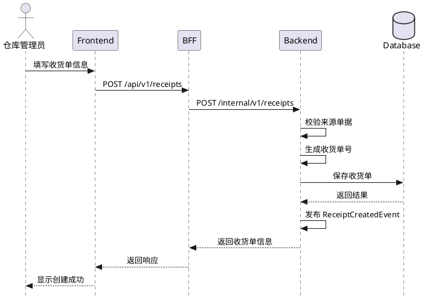
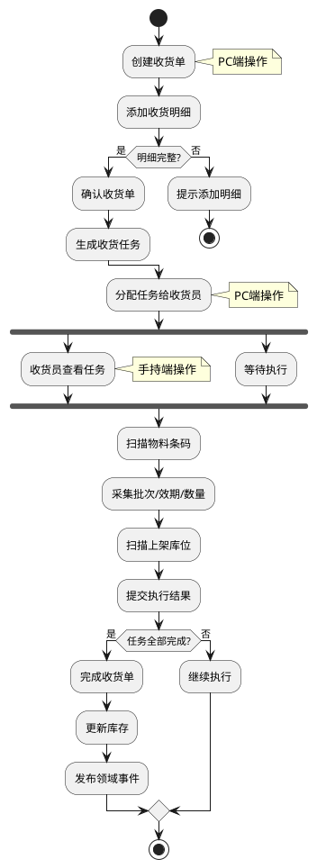
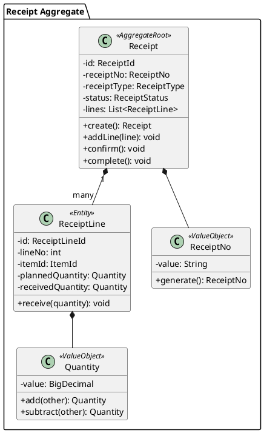
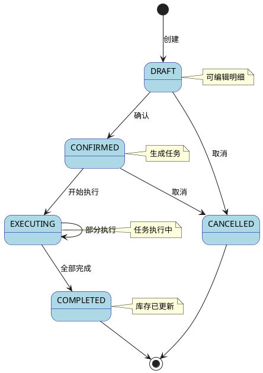

# 技术设计编写规范（Design Guidelines）

## 概述

本规范定义了技术设计（Design）的编写标准，基于领域模型进行技术实现方案设计。

### 技术设计阶段的职责

技术设计（阶段 6）基于前置阶段的成果，明确各层代码的组织和实现方式：

基于的前置阶段：
- 01 用户故事 - 需求宏观理解
- 02 领域分析 - 宏观需求的宏观要素
- 03 需求规格 - 宏观范围、约束
- 04 领域建模 - 微观架构（聚合、实体、值对象、Repository 接口概要）
- 05 前端原型 - 基于 01-04 设计的模拟页面

技术设计的核心职责：
1. 明确 DDD 各层的代码组织方式
2. 设计应用服务（ApplicationService）的职责和方法
3. 详细设计 Repository 接口（参数类型、返回值类型）
4. 设计 API 接口（Controller、DTO、Assembler）
5. 设计错误处理、安全、性能策略
6. 设计外部系统集成方式（Gateway）
7. 绘制关键流程图（时序图、活动图、类图、状态图）

[重要] 技术设计阶段不包含：
- Repository 实现类（RepositoryImpl）设计 - 在阶段 7 完成
- Entity ↔ PO 映射设计 - 在阶段 7 完成
- 数据库表结构设计 - 在阶段 7 完成
- Mapper 设计 - 在阶段 7 完成

完成技术设计后，实现时可以直接参考技术设计编写除仓储层实现类以外的所有代码。

### 两种设计场景

技术设计需要区分两种场景，设计重点和实现策略不同：

#### 场景 1：新模块设计

特征：
- 全新的业务模块，代码库中不存在相关代码
- 需要从零开始设计所有层次的代码
- 例如：新增收货模块、新增盘点模块

设计重点：
- 完整的四层架构设计
- 所有领域对象、应用服务、API、DTO 的设计
- 完整的 Repository 接口设计

实现后的测试：
- 技术设计（阶段 6）+ 仓储设计（阶段 7）完成后
- 所有代码编写完成
- 可以直接 run app 进行端到端测试

#### 场景 2：已有模块迭代设计

特征：
- 在已有业务模块基础上新增或修改功能
- 代码库中已存在相关的领域对象、应用服务、Repository 等
- 例如：收货模块新增质检流程、库存模块新增批次追溯

设计重点：
- 识别需要新增的代码（新的聚合、值对象、应用服务方法、API）
- 识别需要修改的代码（已有聚合的新方法、已有 Repository 的新接口）
- 明确新旧代码的集成点
- 评估对已有基础设施层的影响

实现后的测试：
- 技术设计（阶段 6）+ 仓储设计（阶段 7）完成后
- 新代码编写完成
- 可能需要修改已有基础设施层代码（RepositoryImpl、PO、Mapper）
- 修改完成后才能 run app 进行端到端测试

[重要] 迭代设计的特殊考虑：
- 需要在设计文档中明确标注"新增"和"修改"
- 需要评估对已有代码的影响范围
- 需要考虑向后兼容性
- 可能需要数据迁移方案

### 相关规范

- **领域建模规范**：参见 `24-DOMAIN-MODEL.md`
- **仓储设计规范**：参见 `27-REPOSITORY-DESIGN.md`
- **DDD 架构规范**：参见 `ddd-architecture.md`
- **技术架构规范**：参见 `tech-stack.md`
- **TDD 工作流程**：参见 `20-TDD-WORKFLOW.md`
- **API 接口 URL 规范**：参见 `40-API-GUIDELINES.md`
- **错误码定义规范**：参见 `41-ERROR-CODE-GUIDELINES.md`

---

## 文件位置

```
.kiro/specs/{feature-name}/06-design.md
```

---

## 模板结构

### 新模块设计模板

```markdown
# {功能名称} - 技术设计

[设计类型] 新模块设计

## 1. 概述

## 2. 架构设计

## 3. 流程图（PlantUML）

## 4. 应用服务设计

## 5. Repository 接口设计

## 6. API 设计

## 7. DTO 设计

## 8. 错误处理

## 9. 安全设计

## 10. 性能考虑
```

### 迭代设计模板

```markdown
# {功能名称} - 技术设计

[设计类型] 迭代设计（基于已有 {模块名称} 模块）

## 1. 概述

## 2. 影响范围分析
### 2.1 需要新增的代码
### 2.2 需要修改的代码
### 2.3 对基础设施层的影响

## 3. 兼容性分析
### 3.1 基础架构兼容性
### 3.2 API 兼容性
### 3.3 仓储兼容性

## 4. 架构设计

## 5. 流程图（PlantUML）

## 6. 应用服务设计
### 6.1 新增的应用服务
### 6.2 修改的应用服务

## 7. Repository 接口设计
### 7.1 新增的 Repository 接口
### 7.2 修改的 Repository 接口

## 8. API 设计
### 8.1 新增的 API
### 8.2 修改的 API

## 9. DTO 设计

## 10. 错误处理

## 11. 安全设计

## 12. 性能考虑

## 13. 数据迁移方案（如需要）
```

---

## 1. 概述

简要描述技术实现方案，包括：
- 设计类型（新模块设计 / 迭代设计）
- 实现目标
- 技术选型依据
- 关键设计决策

### 新模块设计示例

```markdown
## 1. 概述

[设计类型] 新模块设计

本设计基于领域模型实现仓库收货功能，采用 DDD 四层架构：
- **后端**：Spring Boot + MyBatis-Plus
- **BFF**：NestJS
- **前端**：React + Ant Design
- **移动端**：Flutter

关键设计决策：
1. 统一 Receipt 聚合承载所有收货类型
2. 任务驱动模式支持手持端执行
3. 事件驱动实现聚合间通信
```

### 迭代设计示例

```markdown
## 1. 概述

[设计类型] 迭代设计（基于已有收货模块）

本设计在现有收货模块基础上新增质检流程，支持收货后的质量检验：
- 新增 QualityInspection 聚合
- 扩展 Receipt 聚合，增加质检状态
- 新增质检任务和质检结果记录

关键设计决策：
1. 质检作为独立聚合，与收货聚合通过事件通信
2. 支持抽检和全检两种模式
3. 质检结果影响库存可用性

影响范围：
- 需要修改 Receipt 聚合（新增质检状态字段和方法）
- 需要修改 ReceiptRepository 接口（新增按质检状态查询）
- 需要修改 ReceiptPO（新增质检相关字段）- 在阶段 7 处理
- 需要修改数据库表结构（新增质检字段）- 在阶段 7 处理

## 2. 影响范围分析

### 2.1 需要新增的代码

领域层：
- QualityInspection 聚合根
- InspectionId、InspectionStatus 等值对象
- QualityInspectionRepository 接口
- InspectionSubmittedEvent、InspectionCompletedEvent 领域事件

应用层：
- QualityInspectionApplicationService

接口层：
- QualityInspectionController
- InspectionRequest、InspectionResponse DTO
- InspectionAssembler

基础设施层（阶段 7）：
- QualityInspectionRepositoryImpl
- QualityInspectionPO
- QualityInspectionMapper

### 2.2 需要修改的代码

领域层：
- Receipt 聚合：新增 qcStatus 字段和 submitForInspection() 方法
- ReceiptStatus 枚举：可能需要新增状态

应用层：
- ReceiptApplicationService：新增 submitForInspection() 方法

接口层：
- ReceiptController：新增提交质检的 API
- ReceiptResponse DTO：新增 qcStatus 字段

基础设施层（阶段 7）：
- ReceiptPO：新增 qc_status 字段
- ReceiptRepositoryImpl：修改查询方法支持质检状态过滤
- 数据库表：wms_receipt 新增 qc_status 字段

### 2.3 对基础设施层的影响

数据库变更：
- wms_receipt 表新增字段：qc_status、qc_required
- 新增表：wms_quality_inspection、wms_inspection_task

Repository 实现变更：
- ReceiptRepositoryImpl 需要修改查询方法
- 新增 QualityInspectionRepositoryImpl

缓存影响：
- Receipt 缓存 key 可能需要调整
- 新增 QualityInspection 缓存策略

消息队列：
- 新增质检相关事件的消费者

## 3. 兼容性分析

### 3.1 基础架构兼容性

分层架构兼容性：
- [兼容] 新增 QualityInspection 聚合符合 DDD 分层架构
- [兼容] 通过领域事件通信，不破坏聚合边界
- [需注意] Receipt 聚合新增字段，需要评估聚合大小

依赖关系兼容性：
- [兼容] 新增的应用服务遵循依赖倒置原则
- [兼容] Repository 接口在领域层，实现在基础设施层
- [兼容] 不引入新的外部依赖

事件驱动兼容性：
- [兼容] 新增领域事件不影响已有事件处理
- [需注意] 需要确保事件消费者的幂等性
- [需注意] 事件顺序可能影响业务逻辑

### 3.2 API 兼容性

向后兼容性评估：
- [兼容] 已有 API 不修改路径和方法
- [兼容] ReceiptResponse 新增字段，不影响已有客户端
- [不兼容] 如果修改 ReceiptResponse 已有字段类型，需要版本升级

API 版本策略：
- 当前版本：v1
- 新增 API：继续使用 v1（向后兼容）
- 如有不兼容变更：升级到 v2

客户端影响：
- PC 端：需要更新以支持质检功能
- 手持端：需要新增质检任务执行界面
- 第三方集成：不受影响（新增功能可选）

### 3.3 仓储兼容性

Repository 接口兼容性：
- [兼容] 新增 Repository 接口不影响已有接口
- [不兼容] ReceiptRepository.findByWarehouseAndStatus() 新增参数
  - 影响：所有调用此方法的代码需要修改
  - 解决方案：保留原方法，新增重载方法
  
```java
// 保留原方法（向后兼容）
Page<Receipt> findByWarehouseAndStatus(
    WarehouseId warehouseId, 
    ReceiptStatus status, 
    Pageable pageable
);

// 新增重载方法
Page<Receipt> findByWarehouseAndStatusAndQc(
    WarehouseId warehouseId, 
    ReceiptStatus status,
    QcStatus qcStatus,
    Pageable pageable
);
```

Repository 实现影响（阶段 7 详细设计）：
- ReceiptRepositoryImpl 需要实现新的重载方法
- 需要修改 ReceiptPO 增加质检字段
- 需要修改 ReceiptMapper 的 SQL
- 需要修改数据库表结构

[注意] 以下内容在阶段 7（仓储设计）详细设计：
- ReceiptPO 字段变更及兼容性处理
- Entity ↔ PO 映射调整
- 数据库表结构变更及兼容性处理
- Mapper SQL 修改
- 数据迁移脚本和回滚方案
- 缓存兼容性处理
```

---

## 2. 架构设计

### 2.1 分层结构

```markdown
### 2.1 分层结构

```
┌─────────────────────────────────────────────────────────────┐
│                    Interfaces 接口层                         │
│              (Controller / DTO / Assembler)                 │
├─────────────────────────────────────────────────────────────┤
│                   Application 应用层                         │
│                (ApplicationService / Command / Query)        │
├─────────────────────────────────────────────────────────────┤
│                     Domain 领域层                            │
│    (Entity / ValueObject / Aggregate / DomainService /      │
│     Repository接口 / DomainEvent)                           │
├─────────────────────────────────────────────────────────────┤
│                 Infrastructure 基础设施层                    │
│           (Gateway / Config / Messaging)                    │
│         [注：Repository实现类在阶段7设计]                    │
└─────────────────────────────────────────────────────────────┘
```
```

### 2.2 模块依赖

```markdown
### 2.2 模块依赖

| 模块 | 依赖 | 说明 |
|-----|------|------|
| interfaces | application | 调用应用服务 |
| application | domain | 编排领域对象 |
| domain | 无 | 核心，不依赖其他层 |
| infrastructure | domain | 实现领域层接口 |
```

### 2.3 包结构

```markdown
### 2.3 包结构

```
com.wms.receiving/
├── interfaces/
│   ├── controller/
│   │   ├── ReceiptController.java
│   │   └── ReceivingTaskController.java
│   ├── dto/
│   │   ├── request/
│   │   └── response/
│   └── assembler/
├── application/
│   ├── service/
│   │   ├── ReceiptApplicationService.java
│   │   └── ReceivingTaskApplicationService.java
│   ├── command/
│   └── query/
├── domain/
│   ├── model/
│   │   ├── receipt/
│   │   └── task/
│   ├── service/
│   ├── repository/
│   └── event/
└── infrastructure/
├── persistence/
├── messaging/
└── config/
```
```

---

## 3. 流程图（PlantUML）

设计阶段必须使用 PlantUML 绘制关键流程图，便于团队理解和评审。

### 3.1 文件组织

PlantUML 图表以独立 .puml 文件形式存储，在 design.md 中通过引用方式使用：

```
.kiro/specs/{feature-name}/
├── design.md                    # 设计文档（引用 PlantUML 文件）
├── diagrams/                    # PlantUML 独立文件目录
│   ├── 01-system-architecture.puml      # 系统架构组件图
│   ├── 02-create-receipt-sequence.puml  # 创建收货单时序图
│   ├── 03-confirm-receipt-sequence.puml # 确认收货单时序图
│   ├── 04-execute-task-sequence.puml    # 执行任务时序图
│   ├── 05-business-flow-activity.puml   # 业务流程活动图
│   ├── 06-receipt-aggregate-class.puml  # Receipt聚合类图
│   ├── 07-task-aggregate-class.puml     # Task聚合类图
│   ├── 08-receipt-state.puml            # Receipt状态图
│   ├── 09-task-state.puml               # Task状态图
│   ├── 10-event-storming.puml           # 事件风暴图
│   └── 11-multi-terminal-flow.puml      # 多端协作流程图
│   └── ...
```

### 3.2 文件命名规范

| 规则 | 说明 | 示例 |
|-----|------|------|
| 序号前缀 | 两位数字序号，便于排序 | `01-`, `02-` |
| 图类型后缀 | 标识图表类型 | `-sequence`, `-activity`, `-class`, `-state` |
| 小写连字符 | 使用小写字母和连字符 | `create-receipt-sequence.puml` |
| 扩展名 | 使用 `.puml` 扩展名 | `xxx.puml` |

### 3.3 必须包含的流程图

| 图类型 | 说明 | 适用场景 |
|-------|------|---------|
| 时序图 | 展示组件间交互顺序 | API 调用流程、多系统协作 |
| 活动图 | 展示业务流程步骤 | 业务流程、状态流转 |
| 类图 | 展示领域模型结构 | 聚合、实体、值对象关系 |
| 组件图 | 展示系统架构 | 分层架构、模块依赖 |
| 状态图 | 展示状态机 | 单据状态流转 |

### 3.2 PlantUML 时序图示例

在 design.md 中引用时序图：

```markdown
### 3.2.1 创建收货单时序图

参考：[创建收货单时序图](diagrams/02-create-receipt-sequence.puml)

该时序图展示了从用户填写收货单信息到系统保存并返回结果的完整流程，包括：
- 前端表单提交
- BFF 层转发
- 后端业务处理（校验、生成单号、保存）
- 领域事件发布
- 响应返回
```

对应的 `diagrams/02-create-receipt-sequence.puml` 文件内容：



### 3.3 PlantUML 活动图示例

在 design.md 中引用活动图：

```markdown
### 3.3.1 收货业务流程活动图

参考：[收货业务流程活动图](diagrams/05-business-flow-activity.puml)

该活动图展示了完整的收货业务流程，包括：
- PC 端创建和确认收货单
- 任务生成和分配
- 手持端执行任务
- 多任务并行处理
- 收货单完成条件判断
```

对应的 `diagrams/05-business-flow-activity.puml` 文件内容：


```

### 3.4 PlantUML 类图示例

在 design.md 中引用类图：

```markdown
### 3.4.1 收货聚合类图

参考：[收货聚合类图](diagrams/06-receipt-aggregate-class.puml)

该类图展示了 Receipt 聚合的内部结构，包括：
- Receipt 聚合根及其属性和方法
- ReceiptLine 实体
- ReceiptNo、Quantity 等值对象
- 聚合内部的关联关系
```

对应的 `diagrams/06-receipt-aggregate-class.puml` 文件内容：



### 3.5 PlantUML 状态图示例

在 design.md 中引用状态图：

```markdown
### 3.5.1 收货单状态流转图

参考：[收货单状态流转图](diagrams/08-receipt-state.puml)

该状态图展示了收货单的完整生命周期，包括：
- 初始状态：DRAFT（草稿）
- 正常流程：DRAFT -> CONFIRMED -> EXECUTING -> COMPLETED
- 异常流程：DRAFT -> CANCELLED
- 各状态间的转换条件
```

对应的 `diagrams/08-receipt-state.puml` 文件内容：


```

### 3.6 PlantUML 组件图示例

```markdown
### 3.6.1 系统架构组件图

```plantuml
@startuml 系统架构
skinparam componentStyle uml2

package "Frontend" {
  [React App] as FE
}

package "Mobile" {
  [Flutter App] as Mobile
}

package "BFF Layer" {
  [NestJS BFF] as BFF
}

package "Backend" {
  package "Interfaces" {
    [Controller] as Ctrl
  }
  package "Application" {
    [ApplicationService] as AppSvc
  }
  package "Domain" {
    [Aggregate] as Agg
    [DomainService] as DomSvc
    [Repository Interface] as RepoIF
  }
  package "Infrastructure" {
    [RepositoryImpl] as RepoImpl
    [Messaging] as Msg
  }
}

database "MySQL" as DB
queue "RabbitMQ" as MQ
database "Redis" as Cache

FE --> BFF : HTTP
Mobile --> BFF : HTTP
BFF --> Ctrl : HTTP

Ctrl --> AppSvc
AppSvc --> Agg
AppSvc --> DomSvc
AppSvc --> RepoIF
RepoIF <|.. RepoImpl
RepoImpl --> DB
AppSvc --> Msg
Msg --> MQ
RepoImpl --> Cache

@enduml
```
```

### 3.7 PlantUML 编写规范

| 规范 | 说明 |
|-----|------|
| 文件格式 | 使用 Markdown 代码块，语言标记为 `plantuml` |
| 图标题 | 使用 `@startuml 图标题` 指定 |
| 皮肤设置 | 使用 `skinparam` 统一样式 |
| 中文支持 | PlantUML 原生支持中文 |
| 注释 | 使用 `note` 添加说明 |

### 3.8 PlantUML 样式模板

```plantuml
' 通用样式设置
skinparam style strictuml
skinparam backgroundColor white
skinparam defaultFontName "Microsoft YaHei"
skinparam defaultFontSize 12

' 时序图样式
skinparam sequenceMessageAlign center
skinparam sequenceArrowThickness 1

' 类图样式
skinparam classAttributeIconSize 0
skinparam classFontStyle bold

' 活动图样式
skinparam activityShape roundedBox
skinparam activityBorderColor DarkBlue

' 状态图样式
skinparam state {
  BackgroundColor LightBlue
  BorderColor DarkBlue
}
```

### 3.9 独立文件模板

每个 `.puml` 文件应包含完整的 PlantUML 定义：


---

## 4. 应用服务设计

描述应用层服务的职责和关键方法。

[重要] 迭代设计需要明确标注"新增"和"修改"。

### 4.1 应用服务职责（新模块设计）

```markdown
### ReceiptApplicationService

职责：
- 编排收货单相关的业务流程
- 调用领域对象和领域服务
- 处理事务边界
- 发布领域事件

关键方法：

createReceipt(CreateReceiptCommand command): ReceiptId
  - 校验来源单据
  - 创建 Receipt 聚合
  - 保存到仓储
  - 发布 ReceiptCreatedEvent

confirmReceipt(ReceiptId receiptId): void
  - 加载 Receipt 聚合
  - 调用 Receipt.confirm()
  - 生成收货任务
  - 保存聚合和任务
  - 发布 ReceiptConfirmedEvent

completeReceipt(ReceiptId receiptId): void
  - 加载 Receipt 聚合
  - 调用 Receipt.complete()
  - 更新库存（通过领域服务）
  - 保存聚合
  - 发布 ReceiptCompletedEvent
```

### 4.1 应用服务职责（迭代设计）

```markdown
### ReceiptApplicationService

#### [修改] 新增质检相关方法

submitForInspection(ReceiptId receiptId): void
  - 加载 Receipt 聚合
  - 调用 Receipt.submitForInspection()
  - 创建 QualityInspection 聚合
  - 保存聚合
  - 发布 InspectionSubmittedEvent

#### [保持不变] 已有方法
- createReceipt()
- confirmReceipt()
- completeReceipt()

### QualityInspectionApplicationService [新增]

职责：
- 编排质检流程
- 管理质检任务
- 处理质检结果

关键方法：

createInspection(CreateInspectionCommand command): InspectionId
  - 创建 QualityInspection 聚合
  - 生成质检任务
  - 保存到仓储

recordInspectionResult(InspectionId id, InspectionResult result): void
  - 加载 QualityInspection 聚合
  - 记录质检结果
  - 更新收货单状态（通过事件）
  - 发布 InspectionCompletedEvent
```

### 4.2 应用服务依赖

```markdown
ReceiptApplicationService 依赖：
  - ReceiptRepository（仓储）
  - ReceivingTaskRepository（仓储）
  - InventoryDomainService（领域服务）
  - DomainEventPublisher（事件发布器）
  - SourceDocumentGateway（外部网关）
```

---

## 5. Repository 接口设计

[重要] Repository 接口在阶段 4 已概要定义（职责和方法名），本阶段明确具体的参数类型和返回值类型。

[重要] 迭代设计需要明确标注"新增"和"修改"。

### 5.1 ReceiptRepository 接口（新模块设计）

```java
public interface ReceiptRepository {
    
    /**
     * Save receipt aggregate
     * @param receipt Receipt aggregate root
     * @return Saved receipt with generated ID
     */
    Receipt save(Receipt receipt);
    
    /**
     * Find receipt by ID
     * @param id Receipt ID
     * @return Optional receipt
     */
    Optional<Receipt> findById(ReceiptId id);
    
    /**
     * Find receipt by receipt number
     * @param receiptNo Receipt number
     * @return Optional receipt
     */
    Optional<Receipt> findByReceiptNo(ReceiptNo receiptNo);
    
    /**
     * Find receipts by warehouse and status
     * @param warehouseId Warehouse ID
     * @param status Receipt status
     * @param pageable Pagination info
     * @return Page of receipts
     */
    Page<Receipt> findByWarehouseAndStatus(
        WarehouseId warehouseId, 
        ReceiptStatus status, 
        Pageable pageable
    );
    
    /**
     * Delete receipt by ID
     * @param id Receipt ID
     */
    void deleteById(ReceiptId id);
}
```

### 5.2 ReceivingTaskRepository 接口（新模块设计）

```java
public interface ReceivingTaskRepository {
    
    /**
     * Save receiving task
     * @param task Receiving task aggregate
     * @return Saved task
     */
    ReceivingTask save(ReceivingTask task);
    
    /**
     * Find task by ID
     * @param id Task ID
     * @return Optional task
     */
    Optional<ReceivingTask> findById(TaskId id);
    
    /**
     * Find tasks by receipt ID
     * @param receiptId Receipt ID
     * @return List of tasks
     */
    List<ReceivingTask> findByReceiptId(ReceiptId receiptId);
    
    /**
     * Find tasks assigned to user
     * @param userId User ID
     * @param status Task status
     * @param pageable Pagination info
     * @return Page of tasks
     */
    Page<ReceivingTask> findByAssigneeAndStatus(
        UserId userId, 
        TaskStatus status, 
        Pageable pageable
    );
}
```

### 5.3 Repository 设计规范

- 只操作聚合根 - 不直接操作聚合内实体
- 接口在领域层 - 实现在基础设施层（阶段 7 设计）
- 返回领域对象 - 不返回 PO 或 DTO
- 使用领域类型 - 参数和返回值使用领域层的类型（ReceiptId、ReceiptStatus 等）
- 封装查询逻辑 - 复杂查询封装在仓储方法中

### 5.4 Repository 接口设计（迭代设计示例）

```java
public interface ReceiptRepository {
    
    // [保持不变] 已有方法
    Receipt save(Receipt receipt);
    Optional<Receipt> findById(ReceiptId id);
    Optional<Receipt> findByReceiptNo(ReceiptNo receiptNo);
    
    // [修改] 扩展查询条件，增加质检状态参数
    Page<Receipt> findByWarehouseAndStatus(
        WarehouseId warehouseId, 
        ReceiptStatus status,
        QcStatus qcStatus,  // 新增参数
        Pageable pageable
    );
    
    // [新增] 按质检状态查询
    Page<Receipt> findByQcStatus(
        QcStatus qcStatus,
        Pageable pageable
    );
    
    void deleteById(ReceiptId id);
}

// [新增] 质检聚合的 Repository 接口
public interface QualityInspectionRepository {
    
    QualityInspection save(QualityInspection inspection);
    
    Optional<QualityInspection> findById(InspectionId id);
    
    List<QualityInspection> findByReceiptId(ReceiptId receiptId);
    
    Page<QualityInspection> findByStatus(
        InspectionStatus status,
        Pageable pageable
    );
}
```

[注意] 迭代设计对 Repository 的影响：
- 修改已有接口方法签名会影响 RepositoryImpl（阶段 7 需要同步修改）
- 新增查询方法需要在阶段 7 实现对应的 SQL
- 如果查询条件涉及新字段，需要在阶段 7 修改数据库表结构

---

## 6. API 设计

[重要] API 设计必须遵循 40-API-GUIDELINES.md 规范：
- Controller 禁止类级别 @RequestMapping
- URL 格式：`/{资源复数名称}/{操作}`
- 查询列表使用 POST 方法：`POST /{resources}/search-by-paging`
- RESTful 风格：GET/POST/PUT/DELETE

### 4.1 BFF 层 API

```markdown
### 4.1 BFF 层 API

#### 收货单 API

| 方法 | 路径 | 说明 | 请求体 | 响应体 |
|-----|------|------|-------|-------|
| POST | /api/v1/receipts | 创建收货单 | CreateReceiptRequest | ReceiptResponse |
| GET | /api/v1/receipts/{id} | 查询收货单 | - | ReceiptDetailResponse |
| GET | /api/v1/receipts | 查询收货单列表 | Query Params | PageResponse<ReceiptResponse> |
| PUT | /api/v1/receipts/{id}/confirm | 确认收货单 | - | ReceiptResponse |
| PUT | /api/v1/receipts/{id}/complete | 完成收货单 | - | ReceiptResponse |

#### 收货任务 API

| 方法 | 路径 | 说明 | 请求体 | 响应体 |
|-----|------|------|-------|-------|
| GET | /api/v1/tasks | 查询任务列表 | Query Params | PageResponse<TaskResponse> |
| GET | /api/v1/tasks/{id} | 查询任务详情 | - | TaskDetailResponse |
| PUT | /api/v1/tasks/{id}/assign | 分配任务 | AssignTaskRequest | TaskResponse |
| POST | /api/v1/tasks/{id}/execute | 执行任务 | ExecuteTaskRequest | TaskExecutionResponse |
| PUT | /api/v1/tasks/{id}/complete | 完成任务 | - | TaskResponse |
```

### 4.2 后端 API

```markdown
### 4.2 后端 API

BFF 调用的后端接口，路径前缀 `/internal/v1`。

| 方法 | 路径 | 说明 |
|-----|------|------|
| POST | /internal/v1/receipts | 创建收货单 |
| GET | /internal/v1/receipts/{id} | 查询收货单 |
| ... | ... | ... |
```

### 4.3 请求/响应示例

```markdown
### 4.3 请求/响应示例

#### 创建收货单

**请求**：
```json
{
  "receiptType": "ASN",
  "sourceDocumentId": "asn-001",
  "sourceDocumentNo": "ASN20241231001",
  "warehouseId": "wh-001",
  "lines": [
    {
      "itemId": "item-001",
      "plannedQuantity": 100,
      "sscc": "123456789012345678"
    }
  ]
}
```

**响应**：
```json
{
  "code": 200,
  "message": "success",
  "data": {
    "id": "rcv-001",
    "receiptNo": "RCV20241231000001",
    "status": "DRAFT",
    ...
  }
}
```
```

---

## 7. DTO 设计

### 7.1 DTO ↔ Entity 映射

```markdown
### 7.1 DTO ↔ Entity 映射

| DTO | Entity | Assembler |
|-----|--------|-----------|
| CreateReceiptRequest | Receipt | ReceiptAssembler |
| ReceiptResponse | Receipt | ReceiptAssembler |
| ExecuteTaskRequest | TaskExecution | TaskAssembler |

#### Assembler 职责

ReceiptAssembler：
- toEntity(CreateReceiptRequest dto): Receipt
- toResponse(Receipt entity): ReceiptResponse
- toDetailResponse(Receipt entity): ReceiptDetailResponse

TaskAssembler：
- toEntity(ExecuteTaskRequest dto): TaskExecution
- toResponse(ReceivingTask entity): TaskResponse
```

---

## 8. 错误处理

[重要] 错误码设计必须遵循 41-ERROR-CODE-GUIDELINES.md 规范：
- 每个应用模块定义独立的错误码枚举类
- 实现 I18nErrorCode 接口
- 使用 @RequiredArgsConstructor 注解
- 每个错误码包含完整的 JavaDoc 注释（错误码编号、中文描述、触发场景、消息模板）
- 消息模板使用英文，支持占位符 {}

```markdown
## 7. 错误处理

### 7.1 错误码设计

| 错误码 | 说明 | HTTP 状态码 |
|-------|------|------------|
| RCV_001 | 收货单不存在 | 404 |
| RCV_002 | 收货单状态不允许此操作 | 400 |
| RCV_003 | SSCC 已被收货 | 400 |
| RCV_004 | 收货数量超出容差范围 | 400 |
| RCV_005 | 物料不在来源单据中 | 400 |
| TSK_001 | 任务不存在 | 404 |
| TSK_002 | 任务未分配 | 400 |
| TSK_003 | 任务已完成 | 400 |
| TSK_004 | 批次号必填 | 400 |
| TSK_005 | 序列号必填 | 400 |

### 7.2 异常类设计

| 异常类 | 说明 |
|-------|------|
| ReceiptNotFoundException | 收货单不存在 |
| InvalidReceiptStatusException | 收货单状态无效 |
| DuplicateSSCCException | SSCC 重复 |
| ToleranceExceededException | 超出容差 |
| TaskNotFoundException | 任务不存在 |
| TaskNotAssignedException | 任务未分配 |
```

---

## 9. 安全设计

```markdown
## 8. 安全设计

### 8.1 权限控制

| 操作 | 所需权限 | 角色 |
|-----|---------|------|
| 创建收货单 | receipt:create | 仓库管理员 |
| 确认收货单 | receipt:confirm | 仓库管理员 |
| 执行任务 | task:execute | 收货员 |
| 查看任务 | task:view | 收货员、仓库管理员 |

### 8.2 数据权限

- 收货员只能看到分配给自己的任务
- 仓库管理员可以看到本仓库所有数据
```

---

## 10. 性能考虑

```markdown
## 9. 性能考虑

### 9.1 缓存策略

| 数据 | 缓存位置 | TTL | 说明 |
|-----|---------|-----|------|
| 收货配置 | Redis | 5min | 容差、上架策略等 |
| 物料信息 | Redis | 10min | 物料基本信息 |
| 库位信息 | Redis | 10min | 库位基本信息 |

### 9.2 批量处理

- 任务生成：批量插入
- 库存更新：批量更新
- 事件发布：批量发布

### 9.3 异步处理

- 库存更新：通过消息队列异步处理
- 通知推送：通过消息队列异步处理
```

---

## 检查清单

### 设计类型确认
- [ ] 明确标注设计类型（新模块设计 / 迭代设计）
- [ ] 如果是迭代设计，明确基于哪个已有模块

### 影响范围分析（仅迭代设计）
- [ ] 列出需要新增的代码（按 DDD 分层）
- [ ] 列出需要修改的代码（按 DDD 分层）
- [ ] 评估对基础设施层的影响（数据库、缓存、消息队列）
- [ ] 评估对已有单元测试的影响

### 兼容性分析（仅迭代设计）
- [ ] 基础架构兼容性：分层架构、依赖关系、事件驱动
- [ ] API 兼容性：向后兼容性、版本策略、客户端影响
- [ ] 仓储兼容性：Repository 接口兼容性、实现影响评估
- [ ] 确定 Repository 接口兼容性解决方案（保留原方法、重载等）
- [ ] 标注需要在阶段 7 处理的内容（PO 映射、数据库变更、缓存等）

### 架构设计
- [ ] 分层结构清晰
- [ ] 模块依赖正确（上层依赖下层）
- [ ] 包结构符合 DDD 规范

### 流程图（PlantUML）
- [ ] 包含核心业务流程时序图
- [ ] 包含业务流程活动图
- [ ] 包含领域模型类图
- [ ] 包含状态流转图（如有状态机）
- [ ] PlantUML 语法正确
- [ ] 图表标题清晰
- [ ] 生成独立 .puml 文件到 diagrams/ 目录
- [ ] 文件命名符合规范（序号+类型后缀）

### 应用服务设计
- [ ] ApplicationService 职责明确
- [ ] Command/Query 分离清晰
- [ ] 事务边界定义明确
- [ ] 迭代设计：明确标注"新增"和"修改"

### Repository 接口设计
- [ ] Repository 接口方法签名完整
- [ ] 方法参数类型明确（使用领域对象）
- [ ] 方法返回值类型明确
- [ ] 查询方法与命令方法分离
- [ ] 迭代设计：明确标注"新增"和"修改"
- [ ] 迭代设计：评估对 RepositoryImpl 的影响

### API 设计
- [ ] RESTful 风格
- [ ] 请求/响应格式统一
- [ ] 包含必要的示例
- [ ] HTTP 方法使用正确
- [ ] 迭代设计：明确标注"新增"和"修改"

### DTO 设计
- [ ] Request DTO 结构完整
- [ ] Response DTO 结构完整
- [ ] DTO ↔ Entity 映射关系清晰
- [ ] Assembler 职责明确
- [ ] 字段验证注解完整

### 错误处理
- [ ] 错误码设计完整
- [ ] 异常类设计合理
- [ ] 异常处理策略明确

### 安全设计
- [ ] 权限控制完整
- [ ] 数据权限考虑
- [ ] 敏感数据处理

### 性能考虑
- [ ] 缓存策略合理
- [ ] 批量处理优化
- [ ] 异步处理设计

### 集成设计
- [ ] 外部系统集成方式明确
- [ ] Gateway 接口设计完整
- [ ] 消息队列使用合理

### 测试就绪性
- [ ] 技术设计完成后，能编写领域层单元测试
- [ ] 技术设计完成后，能编写应用层单元测试
- [ ] 技术设计完成后，能编写接口层单元测试
- [ ] 技术设计 + 仓储设计完成后，能进行端到端测试
- [ ] 迭代设计：确认修改基础设施层代码后能 run app

---

## 技术设计与仓储设计的边界

[重要] 以下内容不属于技术设计阶段（阶段 6），在阶段 7（仓储设计）完成：

不包含的内容：
- Entity ↔ PO 映射设计
- Repository 实现类（RepositoryImpl）设计
- 数据库表结构设计
- Mapper 接口设计
- SQL 查询优化
- 数据库索引设计
- 分库分表策略

技术设计阶段的职责：
- Repository 接口详细设计（方法签名、参数类型、返回值类型）
- 应用服务设计
- API 设计
- DTO 设计
- 错误处理设计
- 安全设计
- 性能策略设计

---

## 下一步

完成 design.md 后，进入数据库设计阶段，编写 database-design.md。

---

最后更新：2026-01-03
